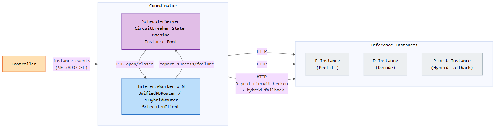
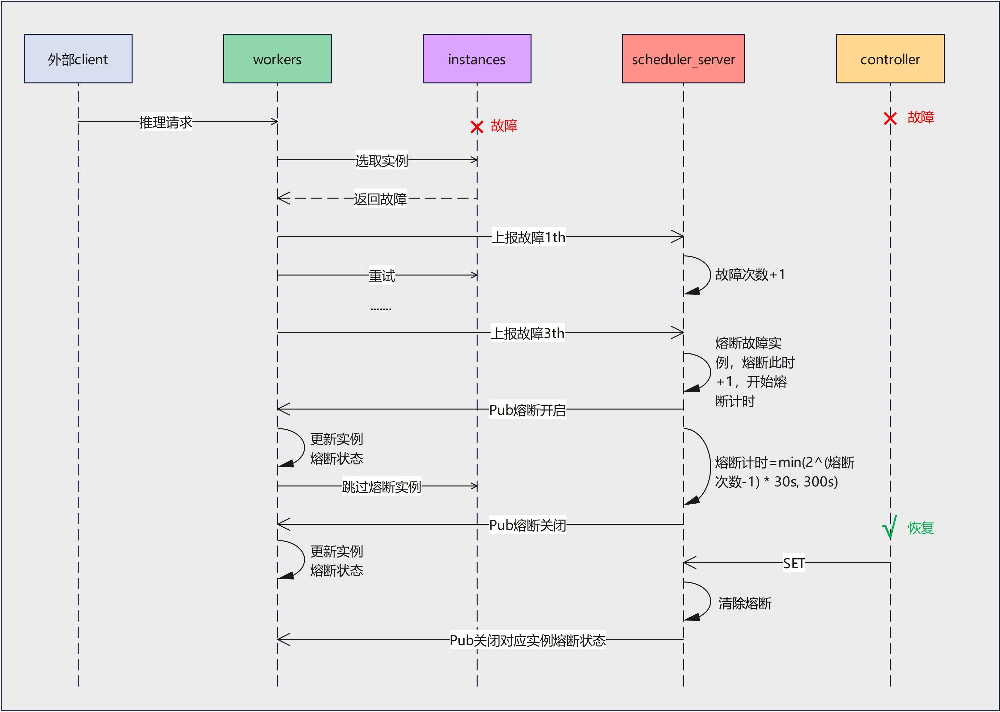
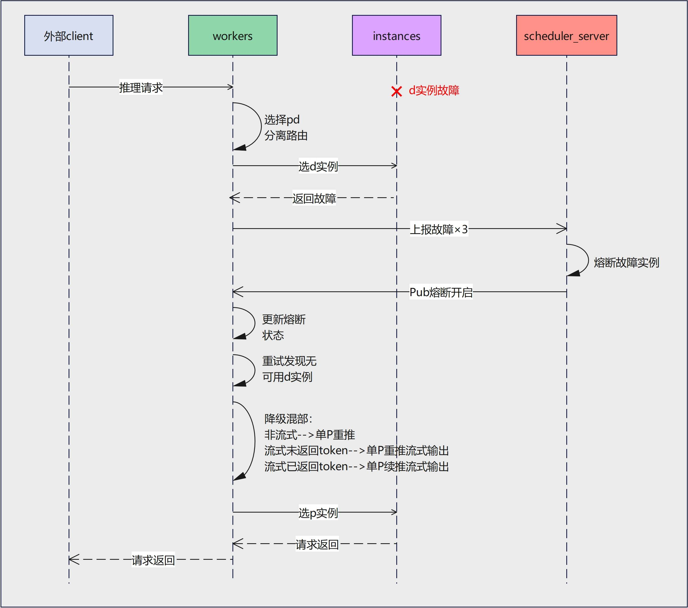

# Coordinator 自熔断需求设计文档

## 1. 需求背景与目的

### 1.1 背景

MindIE-PyMotor 的 Coordinator 承担请求路由职责，将推理请求转发到后端推理实例（P/D/U）。在生产环境中，推理实例可能因进程崩溃、OOM、网络分区等原因发生故障。

传统做法依赖 Controller 感知故障后推送实例变更事件（SET/DEL），再由 Coordinator 停止路由到故障实例。这一链路存在以下问题：

- **依赖 Controller 可用性**：若 Controller 自身故障，Coordinator 无法获得故障通知，持续路由到坏实例。
- **PD 分离场景请求丢失**：在 1P1D 部署下，请求已选择 PD 分离路由后，若 D 实例故障导致无可用 D 实例，该请求无法继续完成推理，直接丢失。Controller 重新摘除 D 实例后，新请求可以改走其他路由，但已在途的请求无法挽回。

### 1.2 目的

在 Coordinator 内部引入**自熔断机制**，使 Coordinator 能够基于自身观测到的请求成败，主动隔离故障实例，并在 D 池耗尽时将请求降级到单 P 或 U 实例继续完成推理。具体目标：

- **快速隔离**：连续失败达到阈值后立即熔断，不再路由到故障实例。
- **自动恢复**：熔断超时后自动尝试恢复，实例恢复正常后解除熔断。
- **Controller 独立性**：Controller 故障期间，Coordinator 依然能够正确规避坏实例。
- **PD 分离降级保全请求**：D 实例全部熔断时，自动降级到单 P 或 U 实例完成推理，避免请求丢失，保障业务可用性。

---

## 2. 架构设计

### 2.1 整体架构



熔断功能涉及 Coordinator 内的两类角色：

| 角色 | 组件 | 职责 |
|---|---|---|
| 熔断中枢 | `SchedulerServer` | 维护各实例的熔断状态机，接收上报，广播熔断变更 |
| 熔断执行者 | `InferenceWorker`（`SchedulerClient`） | 上报请求成败，本地缓存熔断状态，路由时跳过被熔断实例 |

**Controller** 负责推送实例变更事件（SET/ADD/DEL）到 `SchedulerServer`，SET 事件会触发熔断状态全量清除。

**Inference Instances** 是最终接收请求的推理实例（P 实例负责 Prefill，D 实例负责 Decode，P 或 U 实例在降级时承担完整推理）。

### 2.2 熔断状态机

每个推理实例对应一个独立的熔断状态机，状态转换规则如下：

```text
正常（CLOSED）
    │
    │  连续 failure 达到阈值（默认 3 次）
    ▼
熔断（OPEN）──── 超时自动恢复 ────► 正常（CLOSED）
    │                                      ▲
    │  收到 success 上报                    │
    └──────────────────────────────────────┘
```

- **触发熔断**：连续 failure 上报达到阈值，立即进入 OPEN 状态。
- **熔断时长**：采用指数退避，`min(2^(熔断次数-1) × 30s, 300s)`，随着反复故障逐步延长，上限 300s。
- **提前恢复**：熔断期间若收到 success 上报（如探针请求成功），立即解除熔断。
- **强制清除**：Controller 推送 SET 事件时，所有熔断状态强制清除。

### 2.3 状态同步机制

`SchedulerServer` 是熔断状态的**权威来源**，`InferenceWorker` 侧维护**最终一致的本地缓存**：

- `InferenceWorker` 通过 `SchedulerClient` 以 fire-and-forget 方式异步上报 success/failure，不阻塞请求路径。
- `SchedulerServer` 状态变更后，通过 **ZMQ PUB/SUB** 广播 `{instance_id, open/closed}` 给所有 Worker。
- Worker 收到广播后更新本地 `_cb_blocked_instances` 集合，后续路由直接读取本地集合，无需远程查询。

### 2.4 PD 分离降级设计

在 1P1D 部署场景下，若 D 实例全部熔断，`UnifiedPDRouter` 检测到 D 池无可用实例后，将请求降级到 `PDHybridRouter`，由单个 P 或 U 实例完成完整推理。

降级分三种情形：

| 情形 | 触发条件 | 处理方式 |
|---|---|---|
| 非流式降级 | 非流式请求，D 池耗尽 | 将原始 prompt 重新发送到 P/U 实例，等待完整响应 |
| 流式重启（restart） | 流式请求，HTTP 200 尚未提交，客户端未收到任何 token | 将原始 prompt 重新发送到 P/U 实例，重新开始流式输出 |
| 流式续推（resume） | 流式请求，已向客户端返回部分 token | 利用已生成的 token 构造续推请求，在 P/U 实例上继续流式输出，对客户端透明 |

---

## 3. 时序说明

### 3.1 基础熔断功能时序



**流程说明：**

1. 外部 client 发送推理请求，Worker 选取推理实例后，实例返回故障。
2. Worker 向 `SchedulerServer` 上报故障（第 1 次），SchedulerServer 故障计数 +1，Worker 重试。
3. 连续上报故障达到阈值（第 3 次）后，SchedulerServer 触发熔断：
   - 将该实例标记为 OPEN。
   - 启动熔断计时器（时长 = `min(2^(熔断次数-1) × 30s, 300s)`）。
   - 通过 ZMQ PUB 广播**熔断开启**事件。
4. Worker 收到广播，更新本地熔断状态，后续请求路由时跳过该实例。
5. 当 Controller 感知到实例恢复并推送 SET 事件后，SchedulerServer 清除熔断，广播**熔断关闭**事件。
6. Worker 更新本地状态，恢复正常路由。

> 若实例在熔断计时器超时前自然恢复，SchedulerServer 会在超时后自动广播熔断关闭，无需等待 Controller。

### 3.2 PD 分离降级混部时序



**流程说明：**

1. 外部 client 发送推理请求，Worker 选择 PD 分离路由，选取 D 实例，D 实例返回故障。
2. Worker 连续上报 D 实例故障 ×3，SchedulerServer 熔断该 D 实例，广播**熔断开启**事件。
3. Worker 更新本地熔断状态，重试时发现 D 池中已无可用实例。
4. Worker 触发降级逻辑，根据当前请求状态选择降级方式：
   - **非流式**：将完整 prompt 重新发送到 P 实例，等待完整响应后返回。
   - **流式未返回 token**：将完整 prompt 重新发送到 P 实例，以流式方式输出。
   - **流式已返回 token**：基于已生成 token 构造续推请求，在 P 实例上继续流式输出。
5. Worker 选取 P 实例，完成推理，将结果返回给外部 client。

---

## 4. 关键设计决策

### 4.1 熔断状态集中管理，本地缓存消费

熔断状态由 `SchedulerServer` 集中维护，保证多 Worker 视图一致。Worker 本地仅维护影子缓存，路由决策不产生额外 RPC 开销，不影响请求延迟。

### 4.2 上报异步 fire-and-forget

Worker 的 success/failure 上报通过 `asyncio.create_task` 异步执行，与请求处理并行，不引入额外时延。

### 4.3 指数退避熔断时长

熔断时长随故障次数指数增长（30s, 60s, 120s, ..., 上限 300s），对于持续故障实例减少频繁恢复尝试，降低对故障实例的无效探测。

### 4.4 Controller SET 事件强制清除熔断

Controller 推送全量实例（SET 事件）时，视为实例集合已经过健康校验，此时强制清除所有熔断状态，避免历史熔断影响新实例集合的可用性。

### 4.5 流式降级对客户端透明

流式续推（resume）场景下，`Rescheduler` 缓存已生成的 token 信息，在 P 实例上构造续推请求，客户端无感知地继续接收后续 token，不发生连接中断。
