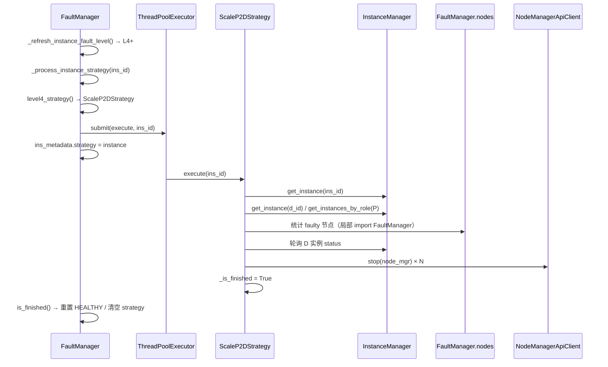
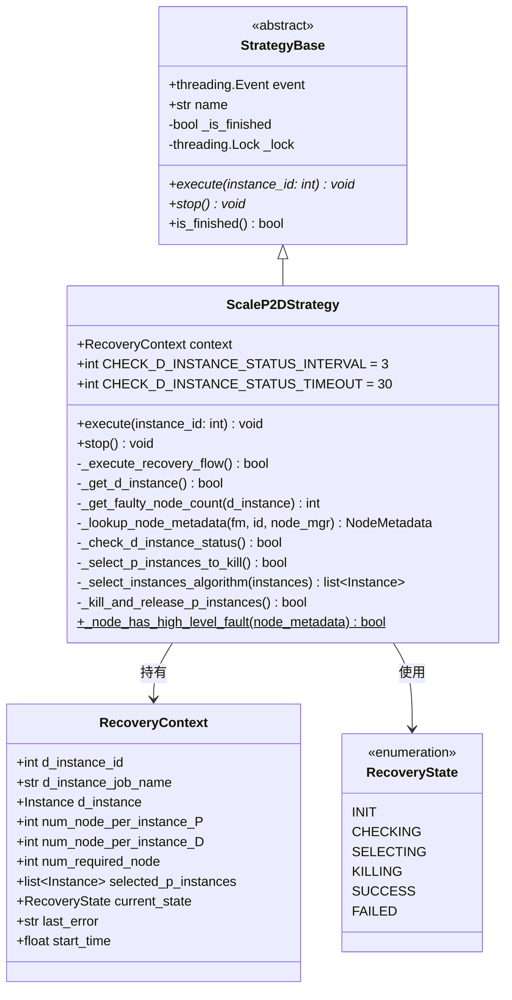
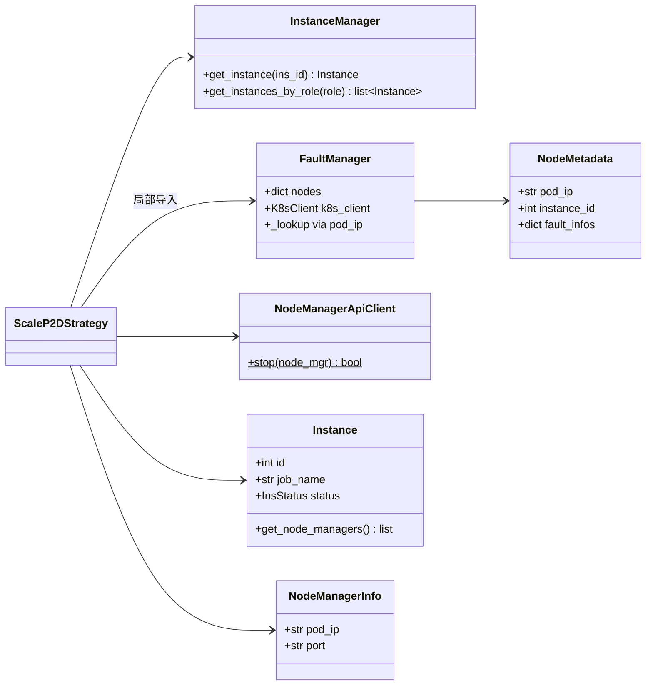
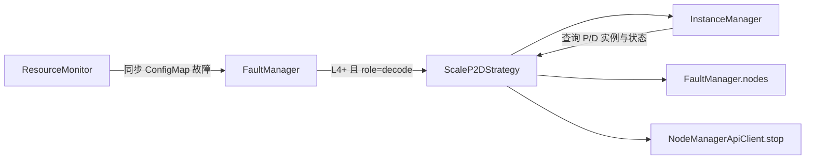
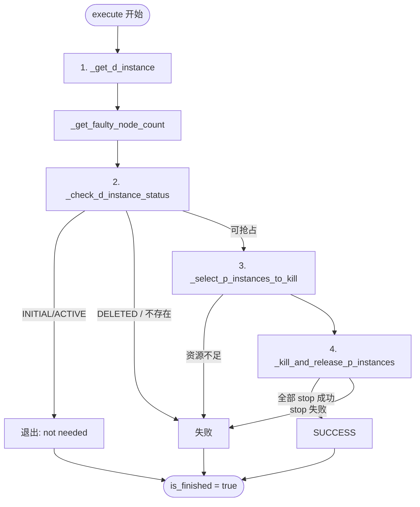

# ScaleP2D 故障恢复特性

## 目录

- [概述](#概述)
- [代码设计](#代码设计)
- [类图](#类图)
- [接口描述](#接口描述)
- [在 RAS 体系中的位置](#在-ras-体系中的位置)
- [触发与调度](#触发与调度)
- [恢复流程](#恢复流程)
- [限制与后续规划](#限制与后续规划)
- [相关代码与测试](#相关代码与测试)

---

## 概述

**ScaleP2D**（Scale Prefill to Decode）是 MindIE Motor 在 **PD 分离**（Prefill / Decode 解耦）场景下的一种故障自愈策略。当 **Decode（D）实例** 因 **L4–L6 级硬件故障** 导致部分节点不可用时，通过 **主动停止若干 Prefill（P）实例** 释放算力与节点资源，为故障 D 实例的恢复或替换腾出容量。

| 项 | 说明 |
|----|------|
| 实现文件 | `motor/controller/fault_tolerance/strategy/scale_p2d.py` |
| 调度方 | `FaultManager` 策略中心（线程池异步执行） |
| 策略注册 | `strategy.py` 中 `level4_strategy` / L5 / L6 |

使用与配置说明见 [ScaleP2D 用户指南](../../user_guide/features/scale_p2d.md)。

---

## 代码设计

### 设计目标

1. **安全抢占**：仅在 D 实例已隔离、非活跃时停止 P 实例，避免业务流量未切断时误杀。
2. **容量可计算**：根据 D 侧 L3+ 故障节点数推导 `num_required_node`，再与 P 池可用容量比对。
3. **可扩展**：P 实例选择逻辑集中在 `_select_instances_algorithm()`，便于替换为代价模型。
4. **解耦依赖**：`FaultManager` 在 `_get_faulty_node_count()` 内 **局部导入**，避免与 `scale_p2d` 模块级循环引用。

### 模块结构

```text
motor/controller/fault_tolerance/strategy/scale_p2d.py
├── RecoveryState          # 恢复流程状态枚举
├── RecoveryContext        # 单次恢复运行的可变上下文（dataclass）
└── ScaleP2DStrategy       # 策略实现（继承 StrategyBase）
    ├── execute()          # 对外入口（FaultManager 调用）
    ├── stop()             # 中断执行
    ├── _execute_recovery_flow()     # 四步流水线编排
    ├── _get_d_instance()            # Step 1
    ├── _get_faulty_node_count()     # Step 1 子逻辑
    ├── _lookup_node_metadata()      # 节点元数据解析
    ├── _check_d_instance_status()   # Step 2
    ├── _select_p_instances_to_kill()# Step 3
    ├── _select_instances_algorithm()# Step 3 可插拔算法
    └── _kill_and_release_p_instances() # Step 4
```

### 分层与职责

| 层次 | 组件 | 职责 |
|------|------|------|
| 调度层 | `FaultManager` | 故障定级、策略选型、线程池提交 `execute`、生命周期与 ETCD 持久化 |
| 策略层 | `ScaleP2DStrategy` | 恢复流水线、上下文维护、日志与错误语义 |
| 数据层 | `InstanceManager` | D/P 实例查询、实例状态（`InsStatus`） |
| 故障数据层 | `FaultManager.nodes` | 节点级 ConfigMap 故障（由 ResourceMonitor 同步） |
| 执行层 | `NodeManagerApiClient` | 对 P 节点下发 HTTP `stop` |

### 时序（与 FaultManager 协作）



### 并发与线程安全

- 单次 `execute()` 在 **独立线程** 中运行；`RecoveryContext` 仅在该线程内读写。
- `StrategyBase._lock` 保护 `_is_finished`；`stop()` 通过 `threading.Event` 通知 `_check_d_instance_status()` 退出轮询。
- `FaultManager` 在 `InstanceMetadata.lock` 内更新 `strategy` 引用，与策略线程解耦。

---

## 类图

### 领域与策略类



### 外部依赖类（只读/调用）



---

## 接口描述

### 1. 策略工厂（`strategy.py`）

ScaleP2D 不由业务方直接 `new`，由故障级别映射函数返回 **策略类**（非实例）。

#### `level4_strategy(fault_code, instance_id, config) -> type[StrategyBase] | None`

| 参数 | 类型 | 说明 |
|------|------|------|
| `fault_code` | `int` | 当前实例最高故障码（ScaleP2D 内未使用，预留） |
| `instance_id` | `int` | 故障实例 ID |
| `config` | `ControllerConfig` | Controller 配置 |

| 返回值 | 条件 |
|--------|------|
| `ScaleP2DStrategy` | `enable_scale_p2d == true` 且 `get_instance(instance_id).role == "decode"` |
| `None` | 开关关闭、实例不存在或 role 非 decode |

`level5_strategy` / `level6_strategy` 当前 **委托** `level4_strategy`，行为一致。

---

### 2. `ScaleP2DStrategy` 公共接口

继承 `StrategyBase`，由 `FaultManager` 在线程池中调用。

#### `execute(instance_id: int) -> None`

| 项 | 说明 |
|----|------|
| **作用** | 启动一次完整 ScaleP2D 恢复；结束时置 `_is_finished = True` |
| **参数** | `instance_id`：故障 Decode 实例 ID |
| **前置** | `InstanceManager` 中可解析该实例（否则记录错误并返回，不创建 context） |
| **副作用** | 写入 `self.context`；可能 stop 多个 P 实例的 NodeManager |
| **成功判定** | `_execute_recovery_flow()` 四步均返回 `True` → `RecoveryState.SUCCESS` |
| **失败判定** | 任一步返回 `False` 或顶层异常 → `RecoveryState.FAILED`，`last_error` 记录原因 |

#### `stop() -> None`

| 项 | 说明 |
|----|------|
| **作用** | 请求策略线程尽快退出（设置 `event`）；并标记 `_is_finished = True` |
| **调用方** | `FaultManager` 在策略升级/实例移除时停止旧策略 |
| **影响** | 正在执行的 `_check_d_instance_status()` 轮询会检测 `event` 并返回 `False` |

#### `is_finished() -> bool`（继承）

| 项 | 说明 |
|----|------|
| **作用** | 供 `FaultManager` 判断可否清空 `strategy` 并重置实例故障级别 |
| **线程安全** | 使用 `_lock` 读取 |

---

### 3. `RecoveryContext` 数据契约

单次 `execute()` 内有效，字段由流水线各步骤填充。

| 字段 | 类型 | 写入阶段 | 说明 |
|------|------|----------|------|
| `d_instance_id` | `int` | 构造 | 故障 D 实例 ID |
| `d_instance_job_name` | `str` | 构造 | D 实例 job 名（日志） |
| `d_instance` | `Instance \| None` | `_get_d_instance` | D 实例对象引用 |
| `num_node_per_instance_D` | `int` | `_get_d_instance` | D 单实例节点数 |
| `num_node_per_instance_P` | `int` | `_select_p_instances_to_kill` | P 单实例节点数（取首个 P） |
| `num_required_node` | `int` | `_get_d_instance` | 需由 P 侧腾出的节点数 |
| `selected_p_instances` | `list[Instance]` | `_select_p_instances_to_kill` | 待停止的 P 实例列表 |
| `current_state` | `RecoveryState` | 各步骤 | 流程状态 |
| `last_error` | `str \| None` | 失败路径 | 人类可读错误摘要 |
| `start_time` | `float` | 构造 | 用于统计 `elapsed_s` |

---

### 4. 内部方法（包内 / 子类协作）

| 方法 | 入参 | 返回值 | 说明 |
|------|------|--------|------|
| `_execute_recovery_flow()` | — | `bool` | 顺序调用 Step 1–4 |
| `_get_d_instance()` | — | `bool` | 加载 D 实例并计算 `num_required_node` |
| `_get_faulty_node_count(d_instance)` | `Instance` | `int` | 统计 L3+ / 缺失元数据节点数 |
| `_lookup_node_metadata(fm, instance_id, node_mgr)` | FM、ID、`NodeManagerInfo` | `NodeMetadata \| None` | pod_ip 匹配或 K8s 反查 node_name |
| `_check_d_instance_status()` | — | `bool` | D 状态门禁与轮询 |
| `_select_p_instances_to_kill()` | — | `bool` | 容量校验 + 调用选择算法 |
| `_select_instances_algorithm(available)` | `list[Instance]` | `list[Instance]` | **可替换** 的 P 选择实现 |
| `_kill_and_release_p_instances()` | — | `bool` | 逐节点 `NodeManagerApiClient.stop` |
| `_node_has_high_level_fault(node_metadata)` | `NodeMetadata` | `bool` | 静态方法，是否存在 L3+ 故障 |

---

### 5. 外部依赖接口

#### `InstanceManager`（单例）

| 方法 | ScaleP2D 用途 |
|------|----------------|
| `get_instance(ins_id: int) -> Instance \| None` | 加载 D 实例、状态轮询 |
| `get_instances_by_role(role: PDRole \| str) -> list[Instance]` | 获取全部 P 实例（`ROLE_P` / `"prefill"`） |

**使用的 `Instance` 能力：**

| 成员 / 方法 | 说明 |
|-------------|------|
| `id`, `job_name` | 标识与日志 |
| `status: InsStatus` | `initial` / `active` / `inactive` / `deleted` |
| `role` | 工厂函数中判定 decode（`level4_strategy`） |
| `get_node_managers() -> list[NodeManagerInfo]` | 枚举实例下 NodeManager 端点 |

#### `FaultManager`（单例，局部导入）

| 数据 / 方法 | ScaleP2D 用途 |
|-------------|----------------|
| `nodes: dict[str, NodeMetadata]` | 按 `pod_ip` + `instance_id` 查设备故障 |
| `k8s_client.get_node_hostname_by_pod_ip(pod_ip)` | 元数据二次查找 |
| `lock` | 遍历 `nodes` 时加锁 |

#### `NodeManagerApiClient`

| 方法 | 说明 |
|------|------|
| `stop(node_mgr: NodeManagerInfo) -> bool` | `POST {pod_ip:port}/node-manager/stop`，body `{}`；成功返回 `True` |

#### `InsStatus` / `PDRole`（`motor.common.resources`）

```python
class InsStatus(str, Enum):
    INITIAL = "initial"
    INACTIVE = "inactive"
    ACTIVE = "active"
    DELETED = "deleted"

class PDRole(str, Enum):
    ROLE_P = "prefill"
    ROLE_D = "decode"
    ROLE_U = "both"
```

---

## 在 RAS 体系中的位置



更完整的 FaultManager 流程见 [FaultManager 设计文档](fault_manager.md)。

---

## 触发与调度

1. `enable_scale_p2d == true`
2. `InstanceManager.get_instance(instance_id).role == "decode"`
3. 实例故障级别为 **L4 / L5 / L6**

`FaultManager._process_instance_strategy()` 通过 `ThreadPoolExecutor.submit(new_strategy.execute, ins_id)` 异步执行；策略未结束时保留 `ins_metadata.strategy` 与故障级别。

---

## 恢复流程

### 流程图



### 步骤摘要

| 步骤 | 方法 | 要点 |
|------|------|------|
| 1 | `_get_d_instance` | 加载 D 实例；`num_required_node` = L3+ 故障节点数（缺失元数据视同故障） |
| 2 | `_check_d_instance_status` | `initial`/`active` → 立即失败；`inactive` 等 → 轮询最多 30s；超时仍活跃 → 失败 |
| 3 | `_select_p_instances_to_kill` | 可用节点 = `nodes_per_P × (P_count - 1)`；调用选择算法 |
| 4 | `_kill_and_release_p_instances` | 对每个选中 P 的所有 `NodeManagerInfo` 调用 `stop` |

### 恢复状态机

| `RecoveryState` | 含义 |
|-----------------|------|
| `init` | 加载 D 实例 |
| `checking` | 检查 D 隔离状态 |
| `selecting` | 选择 P 实例 |
| `killing` | 停止 P 实例 |
| `success` | 全流程成功 |
| `failed` | 失败或异常 |

**类常量：**

| 常量 | 默认值 | 说明 |
|------|--------|------|
| `CHECK_D_INSTANCE_STATUS_TIMEOUT` | 30s | D 实例状态等待上限 |
| `CHECK_D_INSTANCE_STATUS_INTERVAL` | 3s | 轮询间隔 |

---

## 限制与后续规划

1. **P 选择算法**：占位实现（按 ID 排序），待接入负载/优先级模型。
2. **D 健康校验**：`_verify_d_instance_health()` 未启用（代码 TODO）。
3. **策略范围**：仅 Decode + L4–L6；L3 走其他策略或隔离逻辑。
4. **资源假设**：默认各 P 实例节点数相同。

---

## 相关代码与测试

| 路径 | 说明 |
|------|------|
| `motor/controller/fault_tolerance/strategy/scale_p2d.py` | 策略实现 |
| `motor/controller/fault_tolerance/strategy/strategy.py` | L4–L6 注册与开关 |
| `motor/controller/fault_tolerance/fault_manager.py` | 调度与生命周期 |
| `motor/controller/api_client/node_manager_api_client.py` | `stop` HTTP 客户端 |
| `tests/controller/fault_tolerance/strategy/test_scale_p2d.py` | 单元测试（DT） |

```bash
pytest tests/controller/fault_tolerance/strategy/test_scale_p2d.py -v
```
