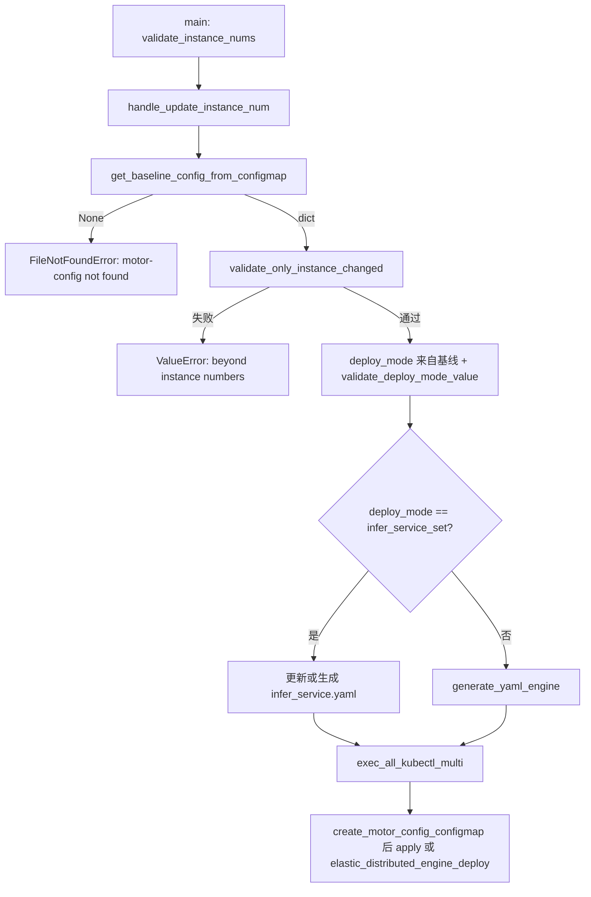

# 实例级手动扩缩容设计说明（MindIE PyMotor）

本文档描述 **`examples/deployer/deploy.py` 在传入 `--update_instance_num` 时的行为**，以及与集群 ConfigMap、YAML 产物的对应关系。表述均来自仓库内上述脚本及其依赖模块的实现，不包含脚本未实现的保证。

## 1. 入口与前置校验

- **入口**：`deploy.py` 的 `main()` 在解析到 `--update_instance_num` 时调用 `handle_update_instance_num(user_config)`，随后 `return`，不会走全量 `deploy_services()`。
- **通用前置**：在分支判断之前，`main()` 会执行 `validate_instance_nums(user_config)`（`lib/generator/engine.py`）。`motor_deploy_config` 中的 `p_instances_num`、`d_instances_num`（PD 分离）或 `hybrid_instances_num`（PD 混部）校验链条为：
    - 字段缺失：内部调用的 `obtain_engine_instance_total`（`lib/utils.py`）抛 `KeyError`，文案 `p_instances_num is required in motor_deploy_config` / `d_instances_num is required ...`。
    - 非整数：`obtain_engine_instance_total` 在 `int(...)` 失败时抛 `ValueError`，文案 `p_instances_num and d_instances_num must be integers`。
    - 越界：`validate_instance_nums` 自身抛 `ValueError`，要求 `> INSTANCE_NUM_ZERO`（0）且 `<= INSTANCE_NUM_MAX`（16），常量定义在 `lib/constant.py`，文案形如 `p_instances_num must be greater than 0` / `must not exceed 16`。

## 2. 基线：集群 ConfigMap `motor-config`

- **读取**：`handle_update_instance_num` 调用 `get_baseline_config_from_configmap(deploy_config["job_id"])`（`lib/generator/k8s_utils.py`）。
- **命令**：`kubectl get configmap motor-config -n <job_id> -o json`（`MOTOR_CONFIG_CONFIGMAP_NAME` 为 `motor-config`，`job_id` 来自当前输入 `user_config` 的 `motor_deploy_config.job_id`，用作 namespace）。
- **解析**：从返回 JSON 的 `data["user_config.json"]` 取出字符串，再 `json.loads` 为 dict；若命令失败、JSON 非法、缺 `data` 或缺 `user_config.json` 键，函数返回 `None`。
- **缺失时**：若基线为 `None`，抛出 `FileNotFoundError`：`ConfigMap motor-config not found. Please deploy once before scaling.`

## 3. 仅允许修改实例数：`validate_only_instance_changed`

- **实现**：`lib/config_validator.py` 的 `validate_only_instance_changed(current_config, baseline_config)`。
- **逻辑**：对两份配置各做一次深拷贝，并从 `motor_deploy_config` 中移除 `p_instances_num` 与 `d_instances_num` 后比较整份 dict；若不等则抛出 `ValueError`：`user_config changes detected beyond instance numbers. Only p_instances_num/d_instances_num can be modified for scaling.`

## 4. 部署模式以集群基线为准

- **取值**：`deploy_mode_arg = baseline_deploy.get("deploy_mode", DEPLOY_MODE_INFER_SERVICE_SET)`（`lib/constant.py`：`DEPLOY_MODE_INFER_SERVICE_SET` 为 `"infer_service_set"`）。
- **校验**：`validate_deploy_mode_value(deploy_mode_arg)` 要求该值属于 `VALID_DEPLOY_MODES`：`infer_service_set`、`multi_deployment`、`single_container`；非法则 `ValueError`，文案含 `Baseline config has invalid deploy_mode`。

后续 YAML 生成与 `kubectl` 行为按 `deploy_mode_arg` 分支（见下节）。**注意**：扩缩容分支里读取的是基线里的 `deploy_mode`，不是仅凭当前本地 `user_config` 决定。

## 5. 刷新 ConfigMap 与 `kubectl` 总入口

- **统一行为**：`handle_update_instance_num` 末尾调用 `exec_all_kubectl_multi(deploy_config, baseline_config, deploy_mode_arg)`（`lib/generator/k8s_utils.py`）。
- **ConfigMap**：`exec_all_kubectl_multi` **首先**调用 `create_motor_config_configmap(job_id)`：用当前进程内已设置的 `g_user_config_path`（由 `main()` 中 `set_user_config_path(user_config_path)` 设置，对应本次命令行解析出的 `user_config.json` 路径）与 `startup/`、`probe/` 等文件组装 `kubectl create configmap motor-config ... --from-file=user_config.json=<路径> -n <job_id>`，经 `apply_configmap` 以 client dry-run 管道到 `kubectl apply`。
- **因此**：每次成功的扩缩容执行都会用**本次输入的** `user_config.json` 文件内容更新集群中的 `motor-config`（与是否走 engine 逐文件扩缩无关）。

## 6. 两种部署模式下的扩缩容行为

### 6.1 `infer_service_set`

- **YAML 路径**：`get_deploy_paths()` 将 InferServiceSet 输出定为 `os.path.join(OUTPUT_ROOT_PATH, "infer_service.yaml")`，其中 `OUTPUT_ROOT_PATH` 为 `./output_yamls`（`lib/constant.py`），路径相对于在 `examples/deployer` 下执行脚本时的当前工作目录。
- **若 `./output_yamls/infer_service.yaml` 已存在**：调用 `update_infer_service_replicas_only(infer_output, deploy_config)`（`lib/generator/infer_service.py`）：加载该 YAML，定位 `kind: InferServiceSet` 文档，将角色名为 `prefill` / `decode` 的 role 的顶层 `replicas` 分别设为当前 `deploy_config` 的 `p_instances_num`、`d_instances_num`（由 `obtain_engine_instance_total` 读出），写回同一文件，并把该路径追加到 `g_generate_yaml_list`。
- **若不存在**：先 `init_service_domain_name(paths, deploy_config)` 初始化服务域名；再校验模板文件 `infer_service_input_yaml`（即 `./yaml_template/infer_service_template.yaml`）是否存在，**不存在则抛 `FileNotFoundError`：`InferServiceSet template yaml not found: <path>.`**；通过后调用 `init_infer_service_domain_name(infer_input, deploy_config)` 与 `generate_yaml_infer_service_set(infer_input, infer_output, user_config)` 全量生成该文件并加入 `g_generate_yaml_list`（与首次生成 InferServiceSet 流程一致）。
- **`kubectl`**：`exec_all_kubectl_multi` 在 `baseline_config is not None` 且 `deploy_mode_arg == infer_service_set` 时，对 `g_generate_yaml_list` 中**每一个**文件执行 `kubectl apply -f <file> -n <job_id>`。扩缩容场景下列表通常仅含 `infer_service.yaml` 一项。

### 6.2 `multi_deployment`（及非 `infer_service_set` 时进入的 else 分支）

- **YAML 生成**：调用 `generate_yaml_engine(engine_input_yaml, engine_output_yaml, user_config)`（`lib/generator/engine.py`）。`engine_output_yaml` 为 `os.path.join(OUTPUT_ROOT_PATH, g_engine_base_name)`，对每个 `p_index in range(p_total)`、`d_index in range(d_total)` 写出 `{engine_output_yaml}_p{index}.yaml` / `_d{index}.yaml`，并全部追加到 `g_generate_yaml_list`。`g_engine_base_name` 由 `update_engine_base_name` 按引擎类型设置（如 vLLM 为 `vllm`，见 `SERVER_BASE_NAME_MAP` 等）。
- **`kubectl`**：`exec_all_kubectl_multi` 在存在 `baseline_config` 且模式非 `infer_service_set` 时，调用 `elastic_distributed_engine_deploy(deploy_config, baseline_deploy_config, OUTPUT_ROOT_PATH)`（实现位于 **`lib/generator/k8s_utils.py`**，与 `engine.py` 中同名函数逻辑一致，实际执行以 `k8s_utils` 为准）。
- **缩容**：对 P 或 D，若目标实例数 `<` 基线，从 `index = base-1` 递减到 `total`，对文件 `{OUTPUT_ROOT_PATH}/{g_engine_base_name}_{p|d}{index}.yaml` 执行 `kubectl delete -f`；若文件仍存在则 `os.remove`。
- **扩容**：若目标 `>` 基线，对 `index in range(base, total)` 的上述路径执行 `kubectl apply -f`。
- **顺序**：先 `scale_engine_by_type(..., NODE_TYPE_P)`，再 `scale_engine_by_type(..., NODE_TYPE_D)`。

**说明**：`handle_update_instance_num` 在 `deploy_mode` 非 `infer_service_set` 时**不会**对 controller/coordinator 等调用 `generate_yaml_*`；仅生成 engine 多文件并由 `elastic_distributed_engine_deploy` 做增量 apply/delete。与全量部署路径不同。

## 7. 与 `--update_config` 的差异（便于对照）

- **`handle_update_config`**（`--update_config`）：同样读取 `motor-config` 基线；若当前 `p_instances_num`/`d_instances_num` 与基线不一致，抛出 `ValueError`，提示使用 `--update_instance_num` 做实例扩缩；否则校验 `deploy_mode` 一致及白名单字段，再 `create_motor_config_configmap`，**不**执行 `elastic_distributed_engine_deploy` 或 InferServiceSet 的 apply 列表扩缩。
- **基线缺失文案**：`--update_config` 下为 `ConfigMap motor-config not found or has no user_config in cluster. Please deploy once before updating configmap.`

## 8. 关键符号与辅助函数（源码位置）

| 名称 | 文件 |
|------|------|
| `handle_update_instance_num` | `examples/deployer/deploy.py` |
| `get_baseline_config_from_configmap`、`run_cmd_get_output`、`exec_all_kubectl_multi`、`create_motor_config_configmap`、`elastic_distributed_engine_deploy`、`scale_engine_by_type` | `examples/deployer/lib/generator/k8s_utils.py` |
| `validate_only_instance_changed`、`strip_instance_nums`、`validate_deploy_mode_value` | `examples/deployer/lib/config_validator.py` |
| `generate_yaml_engine`、`validate_instance_nums`、`update_engine_base_name` | `examples/deployer/lib/generator/engine.py` |
| `generate_yaml_infer_service_set`、`update_infer_service_replicas_only` | `examples/deployer/lib/generator/infer_service.py` |
| `obtain_engine_instance_total` | `examples/deployer/lib/utils.py` |
| `MOTOR_CONFIG_CONFIGMAP_NAME`、`OUTPUT_ROOT_PATH`、`INSTANCE_NUM_MAX` 等 | `examples/deployer/lib/constant.py` |

## 9. 流程图（与代码分支一致）

### 9.1 `--update_instance_num` 主流程

## 10. 约束小结（均可在上述函数中逐项核对）

1. 扩缩容前集群中需已有含 `user_config.json` 的 `motor-config`（否则 `get_baseline_config_from_configmap` 返回 `None` 并报错）。
2. 除 `motor_deploy_config.p_instances_num` / `d_instances_num` 外，整份 `user_config` 与基线须一致（`validate_only_instance_changed`）。
3. 实例数合法范围由 `validate_instance_nums` 与常量 `INSTANCE_NUM_ZERO`/`INSTANCE_NUM_MAX` 定义。
4. 每次 `exec_all_kubectl_multi` 都会刷新 `motor-config` 为当前命令使用的 `user_config.json` 文件内容。
5. 多 Deployment 模式下 engine 产物与扩缩容操作文件位于 **`./output_yamls/`** 下，文件名形如 `{engine_base_name}_p0.yaml`；InferServiceSet 模式下主要产物为 **`./output_yamls/infer_service.yaml`**。
