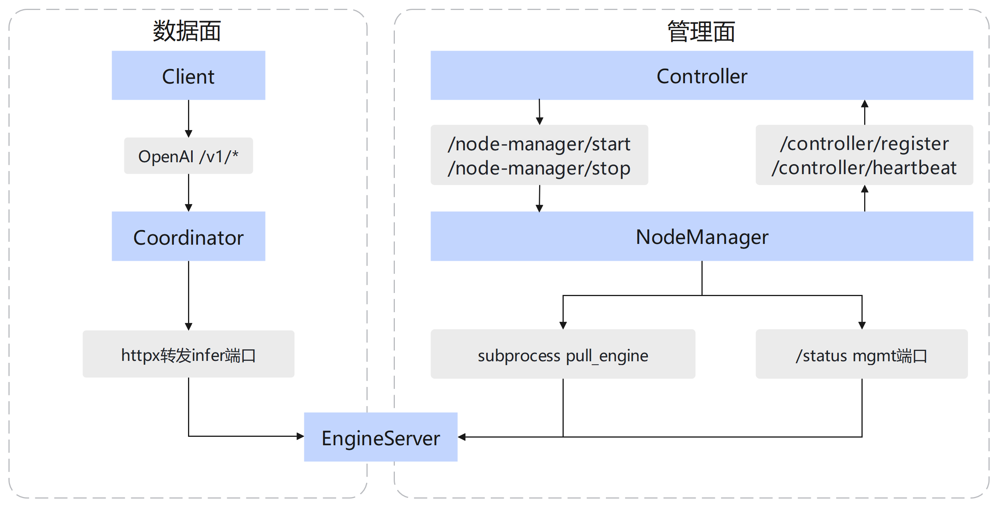

# Motor Engine Server（推理引擎侧进程）

## 功能介绍

在本仓库中，**Engine Server** 指可执行入口 **`engine_server`**（`setup.py` 中 entry point：`engine_server = motor.engine_server.cli.main:main`），实现该功能的脚本路径为 `motor/engine_server/cli/main.py`。

主要功能如下：

- **解析端点配置**：`EndpointConfig.init_endpoint_config()`，经 `ConfigFactory` 得到具体引擎配置（`motor/engine_server/factory/config_factory.py` 中按 `vllm` / `sglang` 等类型选择配置类）。
- **管理面 HTTP（MgmtEndpoint）**：`motor/engine_server/core/mgmt_endpoint.py` 内在 `mgmt_port` 上启动 uvicorn，挂载 Prometheus 相关路由及 **`GET /status`**（路径常量 `STATUS_INTERFACE`，值为 `/status`）。状态字段键为 `STATUS_KEY` 对应常量（与同文件 `NORMAL_STATUS` / `ABNORMAL_STATUS` / `INIT_STATUS` 等配合使用）。可选 **TLS**（`mgmt_tls_config.enable_tls`）。
- **推理面（InferEndpoint）**：由 `EndpointFactory.get_infer_endpoint(config)` 按引擎类型构造（如 `VLLMEndpoint`、`SGLangEndpoint`，见 `motor/engine_server/factory/endpoint_factory.py`），与 `MgmtEndpoint` 并行 `run()`，主线程在 `infer_endpoint.wait()` 阻塞直至退出，再 `shutdown` 两端点。

Node Manager 侧通过子进程命令 **`engine_server`** 拉起本进程，参数在 `motor/node_manager/core/daemon.py` 的 `pull_engine` 中，包括 `--dp-rank`、`--instance-id`、`--role`、`--host`、`--port`、`--mgmt-port`、`--master-dp-ip`、`--config-path`（值为 `Env.user_config_path`）；单容器模式下还会追加 `--kv-port`、`--dp-rpc-port` 等。

## 与周边组件的关系

Engine Server 同时处于**数据面**推理转发链路与**管控面**生命周期链路中：对外承接 Coordinator 转发的 OpenAI 请求；管控面上由 Node Manager 通过子进程拉起 Engine Server 并周期性探测其健康状态，再将结果经 heartbeat 上报 Controller。**Controller 与 Engine Server 之间无直接 HTTP 或进程调用**，启停均经 Node Manager 间接完成。



PD 分离模式下，Coordinator 可能将 Prefill 与 Decode 分派至不同 role 的 Engine Server 实例；单节点 / Hybrid 模式则由同一实例完成推理全流程。

| 阶段     | 方向                          | 接口/机制                        | 说明                                       |
| -------- | ----------------------------- | -------------------------------- | ------------------------------------------ |
| 推理请求 | Coordinator → Engine Server  | infer 端口`/v1/*`              | Coordinator 路由选中实例后转发 OpenAI 请求 |
| 节点注册 | Node Manager → Controller    | `POST /controller/register`    | Node Manager 启动后向 Controller 注册节点  |
| 实例启动 | Controller → Node Manager    | `POST /node-manager/start`     | Controller 完成实例组装后下发启动命令      |
| 引擎拉起 | Node Manager → Engine Server | `subprocess` `engine_server` | Node Manager 子进程拉起 engine_server      |
| 健康探测 | Node Manager → Engine Server | mgmt 端口`GET /status`         | Node Manager 周期性轮询引擎 mgmt 健康状态  |
| 状态上报 | Node Manager → Controller    | `POST /controller/heartbeat`   | 将各 endpoint 健康状态上报 Controller      |
| 实例停止 | Controller → Node Manager    | `POST /node-manager/stop`      | Controller 下发停止指令（含故障恢复场景）  |
| 引擎停止 | Node Manager → Engine Server | `Daemon.stop` SIGKILL          | Node Manager 对引擎子进程发送 SIGKILL      |

Node Manager 经 `engine_server_api_client` 对 `{ip}:{mgmt_port}` 发起 **`GET /status`**（TLS 取自 `motor_nodemanger_config.mgmt_tls_config`）。mgmt `/status` 综合推理面 `/health` 与可选虚推结果；虚推由 `health_check_config.enable_virtual_inference` 控制，默认关闭，机制见 [虚推健康探测](../../user_guide/features/sim_inference.md)，字段见 [配置参考 health_check_config](../../user_guide/configuration/config_reference.md#health_check_config)。

## 环境准备

- `--config-path` 指向包含 `motor_engine_prefill_config` / `motor_engine_decode_config` 的 `user_config.json`（与 Node Manager 挂载路径一致，见[配置文件说明](../../user_guide/configuration/config_reference.md)）。
- Ascend NPU 驱动/HDK、模型权重路径等运行环境要求见 [环境准备](../../user_guide/environment_preparation.md)。

## 配置说明

- **引擎配置块**：`motor_engine_prefill_config` / `motor_engine_decode_config`（含可选 `health_check_config`）。
- **节点侧交叉项**：`motor_nodemanger_config`（如 mgmt TLS，供 Node Manager 探测 Engine Server mgmt 端口）。
- **字段权威说明**：[配置参考](../../user_guide/configuration/config_reference.md) 中 `motor_engine_prefill_config` / `motor_engine_decode_config` 等章节。
- **CLI 侧定义**：`motor/config/endpoint.py` 中 `EndpointConfig` 字段与校验逻辑。

## 使用样例（本地调试）

与 Node Manager 下发命令一致，本地调试需准备：

- **CLI 参数**：`--host`、`--role`、`--port`、`--mgmt-port`、`--instance-id`、`--dp-rank`、`--master-dp-ip`、`--config-path`；单容器模式可能还需 `--kv-port`、`--dp-rpc-port`。
- **配置文件**：`--config-path` 指向的 `user_config.json` 须包含与 `--role` 对应的引擎配置块。
- **运行环境**：NPU/Ascend 运行时与模型权重路径由 `user_config` 内 `engine_config` 指定，见 [环境准备](../../user_guide/environment_preparation.md)。

```bash
engine_server --dp-rank 0 --instance-id 1 --role prefill \
  --host 127.0.0.1 --port 8000 --mgmt-port 8001 \
  --master-dp-ip 127.0.0.1 --config-path /path/to/user_config.json
```

下表说明示例命令中的 CLI 参数（完整定义与校验见 `motor/config/endpoint.py` 中 `EndpointConfig.parse_cli_args`；Node Manager 组装逻辑见 `motor/node_manager/core/daemon.py` 的 `pull_engine`）。

| 参数 | 类型 | 说明 |
|------|------|------|
| `--dp-rank` | int | 数据并行组内 endpoint 序号，默认 `0`。Node Manager 拉起时取 `endpoint.id`，并映射为 vLLM `data-parallel-rank`（见 [examples/deployer/README.md](../../../../examples/deployer/README.md)）。 |
| `--instance-id` | int | 实例 ID，由 Controller 组装后随 `StartCmdMsg` 下发，默认 `0`。 |
| `--role` | string | PD 分离角色：`prefill`、`decode` 或 `union`（混部）。 |
| `--host` | string | 推理面与管理面监听地址（bind IP）。 |
| `--port` | int | 推理业务端口，对外提供 `/v1/*`、`/health` 等 infer 接口。 |
| `--mgmt-port` | int | 管理面端口，对外提供 `GET /status` 及 Prometheus 路由。 |
| `--master-dp-ip` | string | DP master 节点 IP，用于分布式推理组网（对应 vLLM `data-parallel-address` 来源，见 [examples/deployer/README.md](../../../../examples/deployer/README.md)）。 |
| `--config-path` | string | `user_config.json` 路径，须含与 `--role` 匹配的引擎配置块。 |

单容器或跨节点等场景可能额外传入下表参数（本地最小示例可不填）：

| 参数 | 类型 | 说明 |
|------|------|------|
| `--node-rank` | int | 跨节点 PCP 节点序号，由 Controller 按注册顺序分配；传递规则见 [Node Manager 组件文档](./node_manager.md#跨节点-pcp)。 |
| `--kv-port` | int | 单容器模式下 KV 相关通信端口（`Daemon.pull_engine` 在 `single_container_flag` 时追加）。 |
| `--dp-rpc-port` | int | 单容器模式下 DP RPC 端口（同上）。 |
| `--lookup-rpc-port` | int | 可选 lookup RPC 端口（配置存在时追加）。 |
| `--d2d-peer-ips` | string | D2D 权重传输对端 IP 列表，逗号分隔。 |
| `--snapshot-metadata` | string | 容器快照元数据 JSON 路径，启用快照能力时传入。 |

实际端口与角色以调度结果为准；单机调试可参考测试与示例配置。

## 报错与日志

- 默认日志文件路径常量见 `motor/engine_server/constants/constants.py`（如 `LOG_DEFAULT_FILE` 相对 `./engine_server_log/`）。
- Mgmt 面 `/status` 在健康检查异常时返回 `ABNORMAL_STATUS` 等（见 `mgmt_endpoint.get_status` 实现）；Node Manager 侧据此更新 endpoint 状态并可能参与自杀判断（见 `HeartbeatManager`）。
