# ModelArts环境部署8机A2大EP+GLM5.1模型+Yuanrong多级缓存+MindIE-Motor综合调度指导手册

# 1 整体方案介绍

## 1.1 元戎数据系统介绍

元戎数据系统（YuanRong）是一个分布式缓存系统，旨在充分利用计算集群中的HBM、DRAM和SSD资源，构建近计算侧的多级缓存体系，全面提升模型训练与推理、大数据分析以及微服务等场景下的数据访问效率。在推理场景中，元戎作为高性能分布式多级缓存，依托DRAM和SSD构建缓存层，支持应用实例通过共享内存实现免拷贝读取DRAM数据，显著降低数据访问延迟。同时，系统提供高效的H2D（Host
to Device）和D2H（Device to
Host）数据传输接口，支持HBM与DRAM之间的快速数据交换，进一步加速推理过程中的数据流转。

系统架构如下图所示：

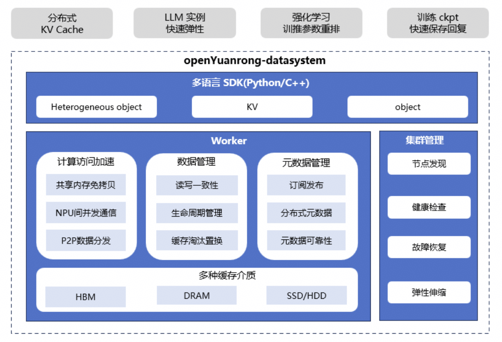

详细信息请参考开源链接：https://pages.openeuler.openatom.cn/openyuanrong-datasystem/docs/zh-cn/latest/index.html

## 1.2 MindIE-Motor介绍

MindIE-Motor基于云原生插件化架构灵活适配多种推理引擎，结合高性能调度与负载均衡能力，构建高可用、可扩展的大规模推理服务。主要包含以下核心能力：

- 提供高性能的请求转发能力，包括负载均衡和kv亲和性调度

- 提供高可靠能力，支持多种故障检测和恢复

- 提供多引擎能力，支持对接vLLM和SGLang等推理引擎

系统架构如下图所示：

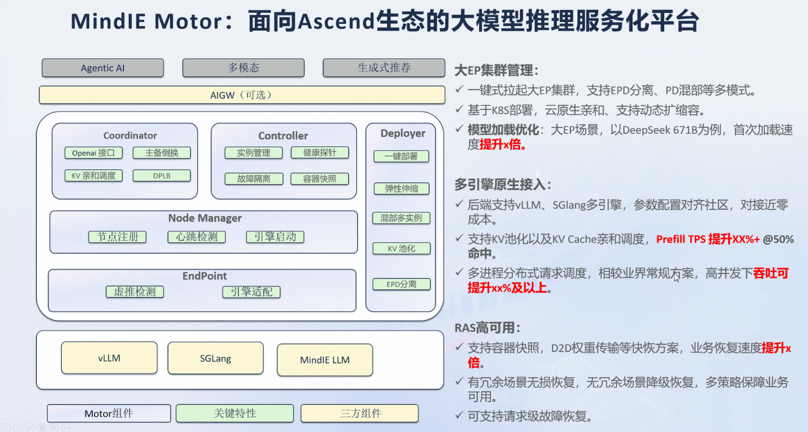

详细信息请参考开源链接：https://gitcode.com/Ascend/MindIE-PyMotor?source_module=search_project&tab=md#markdown-card-anchor

## 1.3 整体架构介绍

基于HCS ModelArts 8.5.1(后续简称MA)平台进行GLM5.1模型大EP部署，支持推理服务级KV cache池化缓存、EP实例内亲和调度(DP域粒度)、EP实例级故障恢复，主要特性如下：

- 部署形态：8机A2大EP；

- 实例网关：MindIE-Motor，支持节点亲和性调度、负载均衡调度；

- KV cache多级缓存：每服务器分配DDR内存0.5-1.6T，通过全局ETCD实现跨大EP缓存池化；

- KV亲和性：大EP实例内亲和调度，支持L1级(HBM)KV命中率计算；

- 关键特性：MA上自动部署，大EP实例级重调度确保可靠性；

整体架构图如下所示：

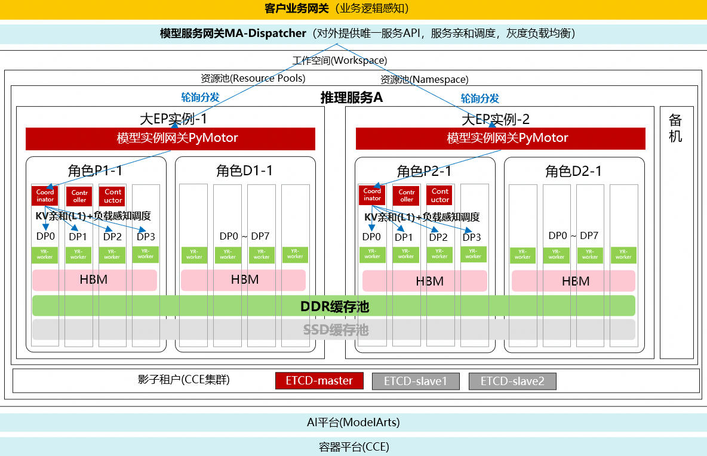

# 2 MA配置启动指导

## 2.1 硬件资源配置

建议配置如下(8机A2)：

- CPU：160核(建议总规格的80%)

- 内存：1,600,000MB(建议总规格的80%)

- 昇腾卡：8个

- 分布式推理-多机多卡-实例组数1-实例数8

- 部署超时时间：30分钟

- 请求超时时间：540s

- 存储挂载：填写用于挂载元戎、MindIE-Motor、模型启动配置文件的OBS文件路径

MA典型配置如下图所示(MA控制台-开发生产-模型部署-在线服务-部署)：

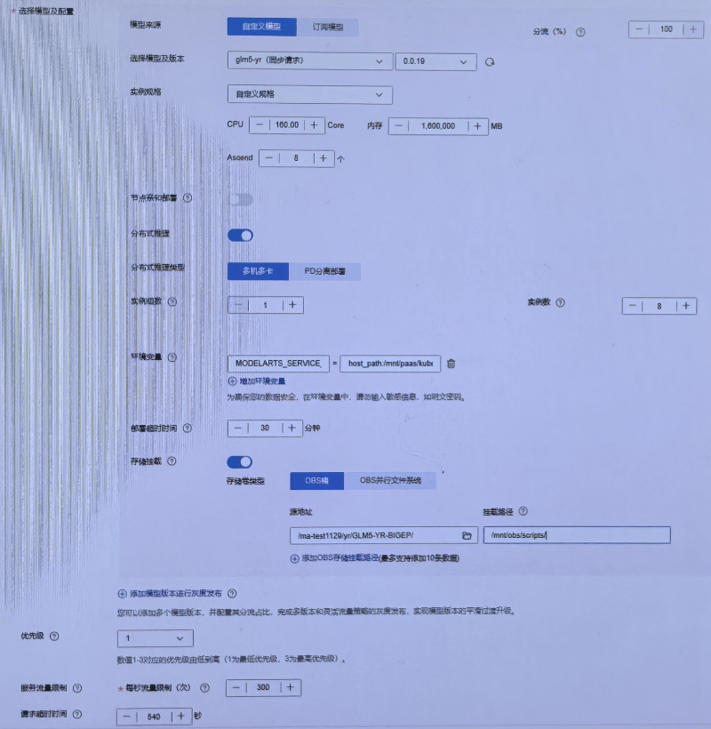

## 2.2 模型管理配置

完整的模型管理内容一般至少包含以下3个版本：

1. 模型服务手工启动版本(空容器，不带模型自动启动脚本、健康检查脚本)；

2. 模型服务自动启动版本；

3. 模型测试版本(用于ais_bench部署)；

其中1用于安装部署调试，3用于精度/性能测试，2用于可靠性测试及正式投产。以下分别展示上述版本典型配置：

手动启动版本配置如下：

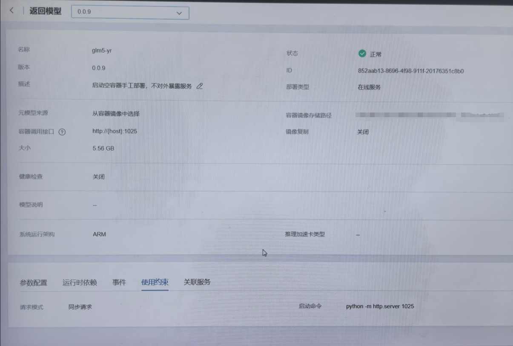

手工启动版本典型配置

手工启动版本中，建议选择主机IP+1025端口号，在启动命令需要挂载服务用以占用容器调用端口(MA约束)。

自动启动版本配置如下：

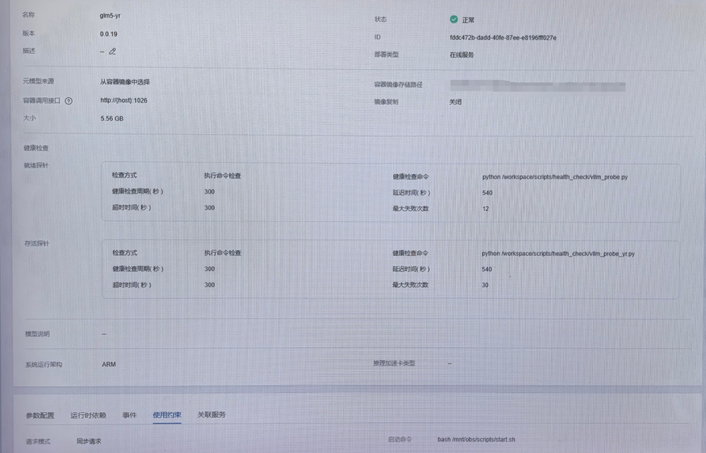

自动启动版本典型配置

模型测试版本(用于ais_bench部署)：
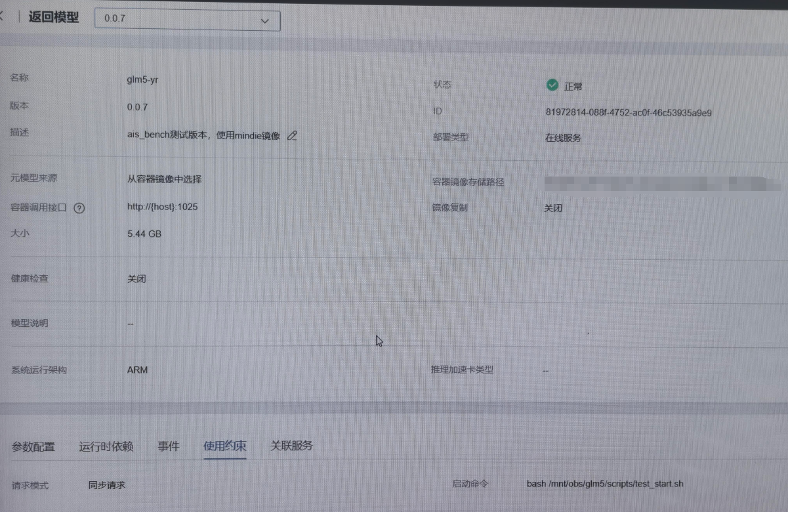

模型测试版本典型配置

test_start.sh实现如下，建议使用MindIE镜像，自带ais_bench工具：

```python
#与容器对外端口号一致
python -m http.server 1025
```

## 2.3 服务启动指导

### 2.3.1 ETCD池化启动

操作指导如下步骤：

1. 登录资源租户，资源租户作用如下：

    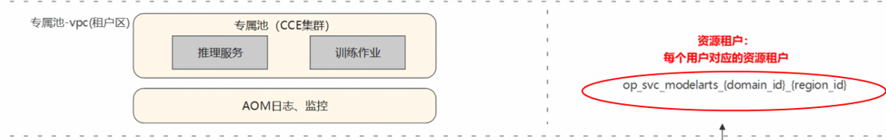

2. 进入HCS界面，选择"服务列表 \> 应用服务 \> 容器镜像服务SWR"

    

3. 点击"组织管理 \> 创建组织"，组织名称"etcd-yuanrong"，并确定创建

    > 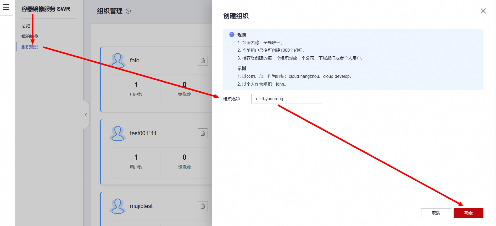

4. 点击"我的镜像 \> 页面上传"

    > 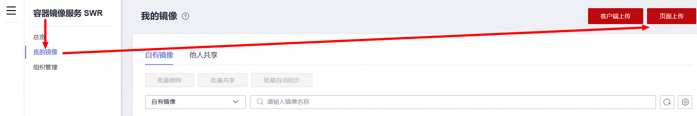

5. 组织选择"etcd-yuanrong"，并上传ETCD镜像

    > 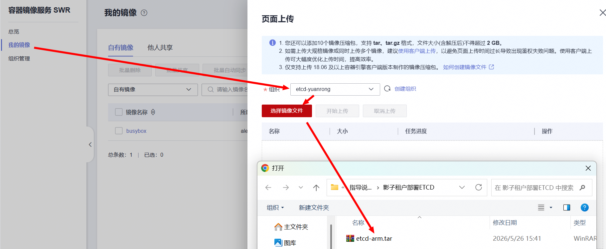
    >
    > ETCD使用v3.5.10版本，建议从quay.io下载镜像(下载指令：docker pull
    > quay.io/coreos/etcd:v3.5.10)

6. 等待镜像上传完毕后，记录镜像地址(框中docker pull后边部分)

    > 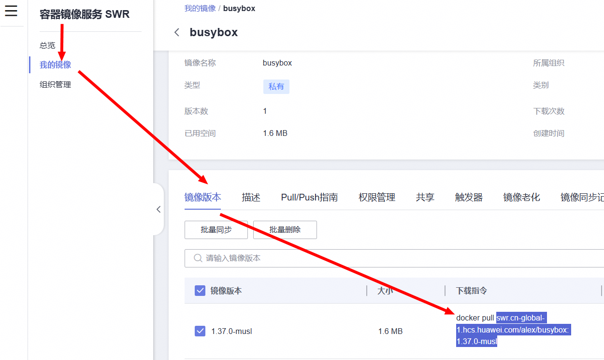

7. 本地创建"etcd-all-latest.yaml"文件，打开并复制3.5章节"ETCD池化部署方案
    \> 部署脚本实现"中的脚本内容，镜像地址修改为步骤6中的地址；

8. 进入HCS界面，选择"服务列表 \> 计算 \> 云容器引擎CCE"

    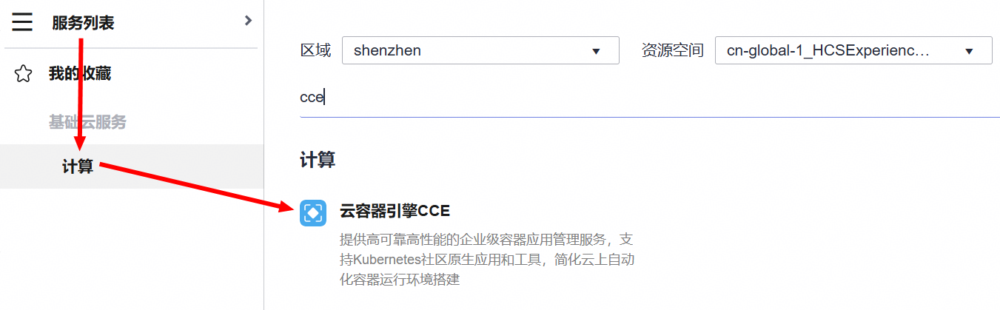

9. 进入CCE界面"集群管理 \> 资源池"，选择并进入要部署服务的资源池

    

10. 选择"工作负载 \> 有状态负载 \> YAML创建"

    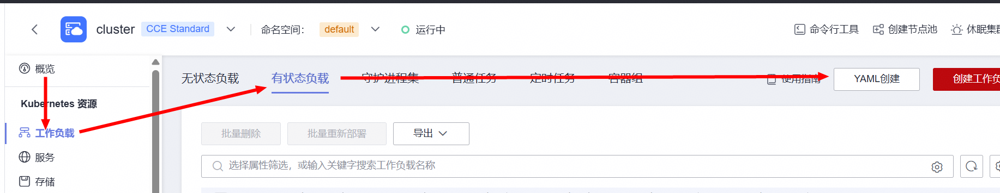

11. 使用YAML方式创建ETCD容器负载，导入etcd-all-latest.yaml

    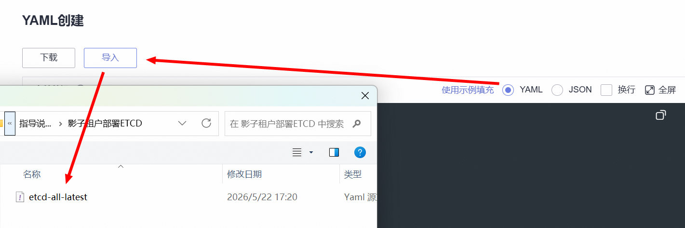

12. 点击进入创建的ETCD容器负载，确认负载列表中三个实例均正常运行，并记录所在节点IP

    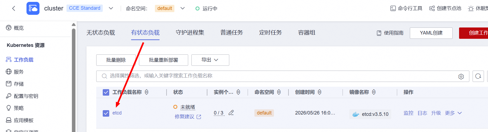

    > 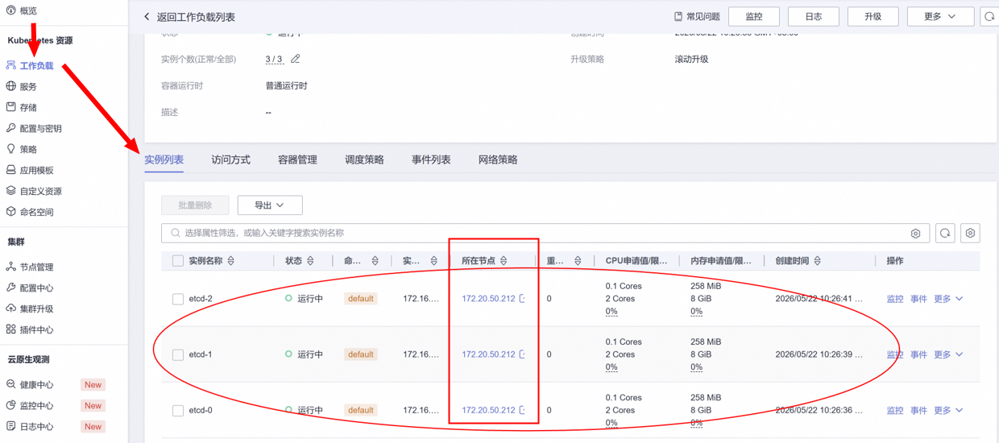

13. 选择"服务"标签，确认已生成"etcd-client-service"、"etcd-headless"等两个服务

    > 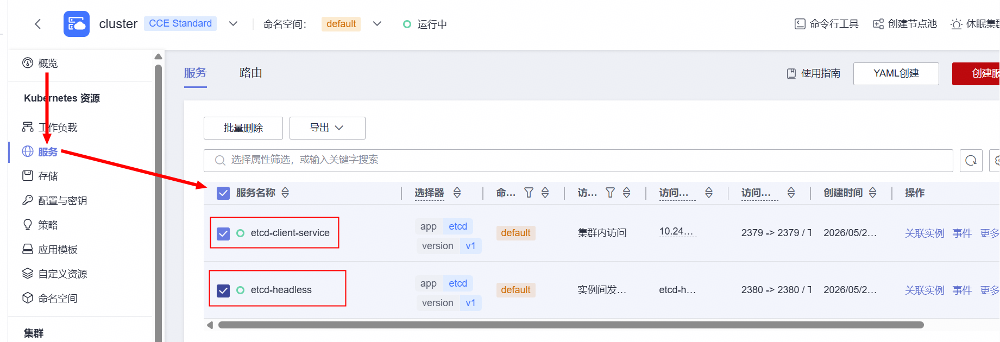

14. 登录步骤12中实例etcd-0对应IP的linux后台，输入指令"ps -ef \| grep
    etcd-0"查看进程，确认进程存在如下：

    > 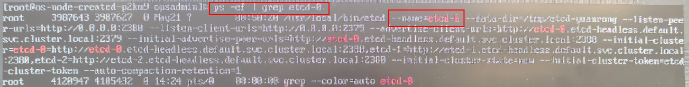

15. 登录步骤12中实例etcd-1对应IP的linux后台，输入指令"ps -ef \| grep
    etcd-0"查看进程，确认进程存在如下

    > 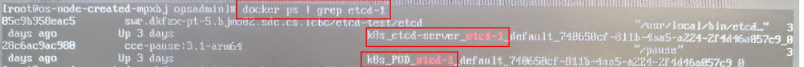

### 2.3.2 ModelArts模型服务启动

1. 进入ModelArts界面，选定工作空间后点击"模型管理 \> 创建模型"；

    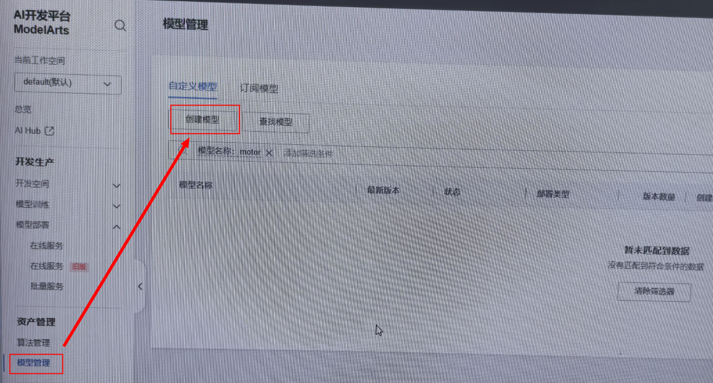

2. 按照2.2章节"模型配置管理"进行配置创建；

    

    注意配置中"健康检查命令"、"启动命令"填写不要有多余空格

3. 点击"资源管理 \> AI专属资源池 \> 弹性集群 Cluster"，选择目标资源池

    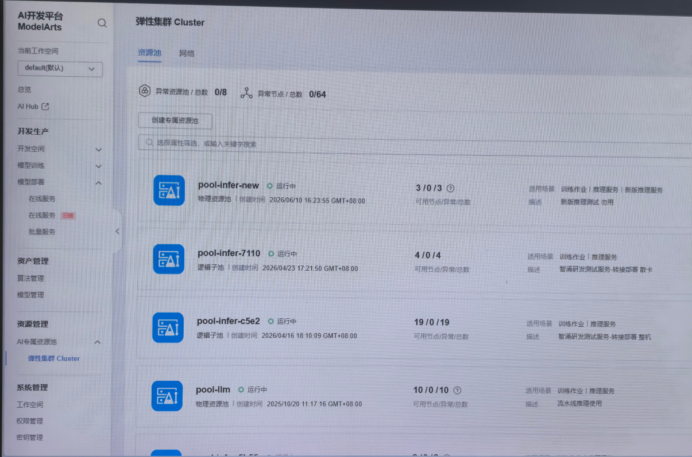

4. 按照2.1章节要求，检查资源池内是否具备足量空闲资源；

    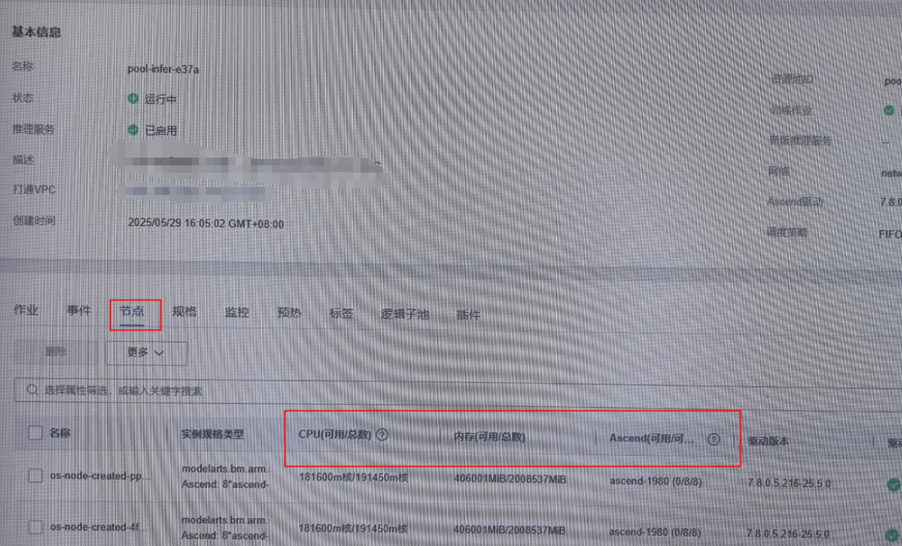

5. 进入"模型部署 \> 在线服务"，点击部署；

    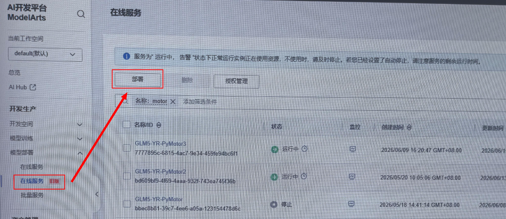

6. 部分项建议按照以下方式配置，其他项根据实际情况自行配置；

    - "选择模型及版本"中，选择步骤1创建的模型及版本

    - "实例规格"中，Ascend设置为8，CPU设为160核，内存1600000MB；

    - 勾选"分布式推理 > 多机多卡"，"实例组数"填写目标大EP实例数，"实例数"为8；

    - "部署超时时间"设置为30分钟；

    - "请求超时时间"设置为540s；

    - "存储挂载"、"环境变量"根据实际情况配置，确保容器内"/mnt/obs/scripts"路径下已存在服务拉起所需文件；

    > 配置完成后点击"立即创建"；

    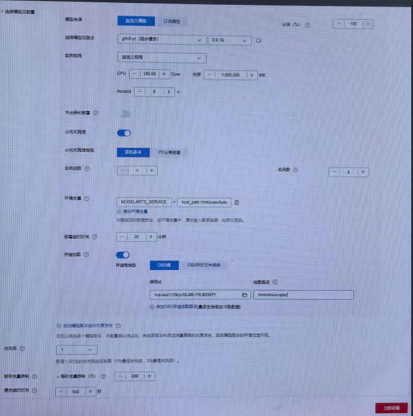

7. 点击进入创建的在线服务页面，观察事件和日志，等待服务状态变为"运行中"即为启动成功；

    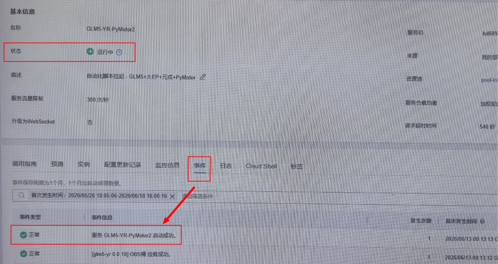

# 3 自动化部署脚本资料

## 3.1 脚本概述及目录架构

自动化部署包含内容及目录架构如下所示：

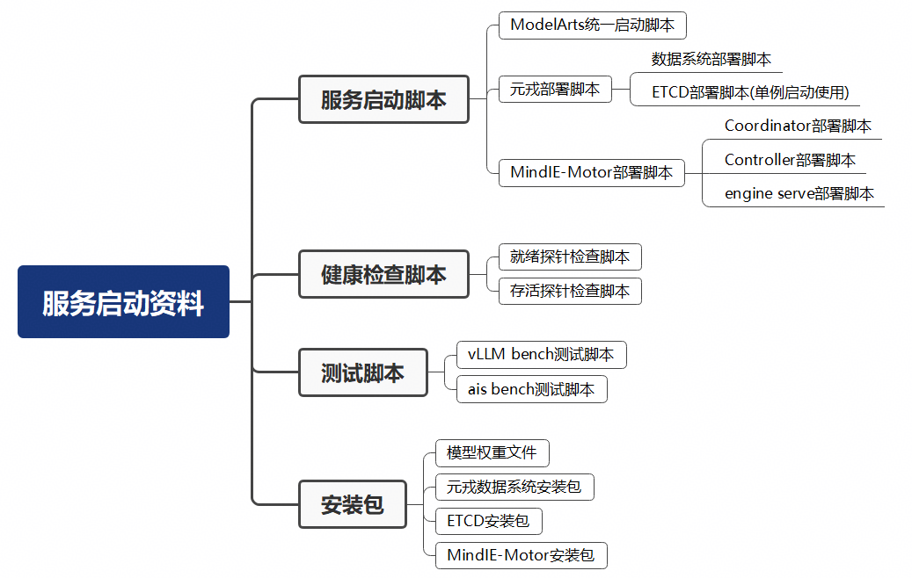

## 3.2 ModelArts统一启动脚本

统一入口脚本不区分主从节点，命名start.sh，为MA自动拉起(模型管理-使用约束)提供统一执行入口，执行操作如下：

- 模型权重下载

- 主、从节点识别(以ranktable中0号节点为主节点)，并修改脚本节点IP配置

- 脚本目录迁移(从OBS/宿主机等外部存储迁移至容器工作目录)

- 分节点粒度自动化部署脚本执行

脚本实现如下：

```bash
set +x
echo "server start!"

## 下载权重
mkdir -p /mnt/cache
mkdir -p /workspace/scripts
SCRIPT_PATH=/workspace/scripts
cp -rf /mnt/obs/scripts/* $SCRIPT_PATH

MOTOR_SCRIPT_PATH="$SCRIPT_PATH/PyMotor"

WEIGHTS_DIR="/mnt/cache/GLM-5.1-W8A8"
if [ ! -d "$WEIGHTS_DIR" ];then
    echo "下载权重"
    [下载模型权重到：/mnt/cache/]
    mv /mnt/cache/[权重文件] /mnt/cache/GLM-5.1-W8A8/
    du -s /mnt/cache/GLM-5.1-W8A8
    df -h
else
    echo "权重目录已存在"
fi

## vllm0.18.0版本需要打补丁mooncake_connector.py，修复glm5.1精度问题

## 更新生成ranktable.json
MS_GLOBAL_RANKTABLE_TABLE=/user/global/config/global_rank_table.json

while true; do
    json_string=$(cat $MS_GLOBAL_RANKTABLE_TABLE)
    echo $json_string;
    RESULT=$(jq -r '.status' $MS_GLOBAL_RANKTABLE_TABLE 2>/dev/null)
    echo $RESULT
    if [[ $RESULT = "completed" ]]; then
        echo "MA ranktable is completed";
        break;
    fi
    sleep 1;
done;

host_IP=$(hostname -I | xargs)
echo "host_IP = $host_IP"

### check port
netstat -anop

### 启动元戎
mkdir -p /mnt/cache/logs
bash $SCRIPT_PATH/yuanrong/start_base_env.sh

NODE_IPS=$(jq -r '.server_group_list[].server_list[].server_ip' "$MS_GLOBAL_RANKTABLE_TABLE")
echo $NODE_IPS
IFS=$'\n' read -r -d '' -a ip_array <<< "$NODE_IPS"
P0="${ip_array[0]}"
P1="${ip_array[1]}"
P2="${ip_array[2]}"
P3="${ip_array[3]}"
D0="${ip_array[4]}"
D1="${ip_array[5]}"
D2="${ip_array[6]}"
D3="${ip_array[7]}"

echo "P0 = $P0"
echo "P1 = $P1"
echo "P2 = $P2"
echo "P3 = $P3"
echo "D0 = $D0"
echo "D1 = $D1"
echo "D2 = $D2"
echo "D3 = $D3"

## 拉起服务
source $MOTOR_SCRIPT_PATH/prepare.sh

LOG_DIR=/mnt/cache/logs/motor/$(date +%Y-%m-%d_%H-%M-%S)/
mkdir -p ${LOG_DIR}

echo "LOG_DIR: ${LOG_DIR}"

## 设置推理引擎负载均衡调用端口为1028(即不使用motor亲和调度)
if [ "$host_IP" = "$P0" ]; then
    echo "this is p0 and proxy"
    echo "start proxy"
    nohup python $SCRIPT_PATH/load_balance_proxy_server_example.py \
        --port 1028 \
        --host 0.0.0.0 \
        --prefiller-hosts $P0 $P1 $P2 $P3 \
        --prefiller-ports 10000 10000 10000 10000 \
        --decoder-hosts $D0 $D0 $D1 $D1 $D2 $D2 $D3 $D3 \
        --decoder-ports 10000 10002 10000 10002 10000 10002 10000 10002 \
        2>&1 | tee ${LOG_DIR}/proxy.log &
fi

## 拉起motor及推理实例
if [ "$host_IP" = "$P0" ]; then
    echo "p0 & coordinator"
    source $MOTOR_SCRIPT_PATH/start_motor.sh coordinator $P0 $P1 $P0 "coordinator" $P2 $P3 2>&1 | tee ${LOG_DIR}/coordinator.log &
    source $MOTOR_SCRIPT_PATH/start_motor.sh prefill $P0 $P1 $P0 "instance-p0" $P2 $P3 2>&1 | tee ${LOG_DIR}/p0.log
elif [ "$host_IP" = "$P1" ]; then
    echo "p1 & controller"
    source $MOTOR_SCRIPT_PATH/start_motor.sh controller $P0 $P1 $P1 "controller" $P2 $P3 2>&1 | tee ${LOG_DIR}/controller.log &
    source $MOTOR_SCRIPT_PATH/start_motor.sh prefill $P0 $P1 $P1 "instance-p0" $P2 $P3 2>&1 | tee ${LOG_DIR}/p1.log
elif [ "$host_IP" = "$P2" ]; then
    echo "p2 & kv_conductor"
    source $MOTOR_SCRIPT_PATH/start_motor.sh kv_conductor $P0 $P1 $P2 "kv_conductor" $P2 $P3 2>&1 | tee ${LOG_DIR}/kv_conductor.log &
    source $MOTOR_SCRIPT_PATH/start_motor.sh prefill $P0 $P1 $P2 "instance-p0" $P2 $P3 2>&1 | tee ${LOG_DIR}/p2.log
elif [ "$host_IP" = "$P3" ]; then
    echo "p3"
    source $MOTOR_SCRIPT_PATH/start_motor.sh prefill $P0 $P1 $P3 "instance-p0" $P2 $P3 2>&1 | tee ${LOG_DIR}/p3.log
elif [ "$host_IP" = "$D0" ]; then
    echo "d0"
    source $MOTOR_SCRIPT_PATH/start_motor.sh decode $P0 $P1 $D0 "instance-d0" $P2 $P3 2>&1 | tee ${LOG_DIR}/d0.log
elif [ "$host_IP" = "$D1" ]; then
    echo "d1"
    source $MOTOR_SCRIPT_PATH/start_motor.sh decode $P0 $P1 $D1 "instance-d0" $P2 $P3 2>&1 | tee ${LOG_DIR}/d1.log
elif [ "$host_IP" = "$D2" ]; then
    echo "d2"
    source $MOTOR_SCRIPT_PATH/start_motor.sh decode $P0 $P1 $D2 "instance-d0" $P2 $P3 2>&1 | tee ${LOG_DIR}/d2.log
elif [ "$host_IP" = "$D3" ]; then
    echo "d3"
    source $MOTOR_SCRIPT_PATH/start_motor.sh decode $P0 $P1 $D3 "instance-d0" $P2 $P3 2>&1 | tee ${LOG_DIR}/d3.log
fi

echo "server start end!"
sleep 36000000

```

注意事项：

- \[  ]中内容需要根据实际环境补充；

- 脚本结尾sleep字段为MA推理1.0场景下必需保留；

## 3.3 yuanrong多级缓存自动化部署脚本

### 3.3.1 目录架构总览

Yuanrong多级缓存自动化部署包含两种方式，分别为ETCD单实例模式、ETCD池化模式。其中ETCD单实例模式需要脚本自行拉起一个ETCD实例，ETCD池化模式直接使用已经部署好的ETCD集群。部署方案脚本如下图所示：

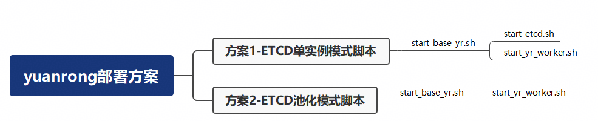

脚本结构说明：部署脚本包含一个父脚本start_base_yr.sh脚本和子脚本start_etcd.sh、start_yr_worker.sh。其中父脚本中依赖子脚本，在父脚本start_base_yr.sh的执行流程中会按需调用两个子脚本start_etcd.sh、start_yr_worker.sh完成ETCD安装和元戎worker启动。父脚本start_base_yr.sh为yuanrong部署的完整流程，包括：

1. 获取集群节点信息

2. 新增元戎 & vllm-ascend补丁

3. ETCD安装部署使用

4. 启动ETCD服务（方案1调用start_etcd.sh启动,
    方案2无需启动，直接使用部署好的etcd集群）

5. 等待ETCD启动成功

6. 启动元戎worker（调用start_yr_worker.sh）

使用注意事项：执行时需要把三个脚本放在同一目录，按实际情况修改start_base_yr.sh中依赖文件的目录，最后通过bash
start_base_yr.sh执行。

### 3.3.2 安装包准备

从以下地址下载元戎whl安装包进行离线安装：

```bash
# 查看目标环境的pagesize:
getconf PAGESIZE

# 如果pagesize为4k，则下载whl包
wget https://gitcode.com/openeuler/yuanrong-datasystem/releases/download/0.8.1/openyuanrong_datasystem-0.8.1-cp311-cp311-manylinux_2_35_aarch64.whl

# 如果pagesize为64k，请联系元戎支持人员获取软件包

```

如果采用ETCD单实例模式进行部署，需要提前下载ETCD
v3.5.10版本，建议从quay.io下载镜像：

```bash
docker pull quay.io/coreos/etcd:v3.5.10
```

### 3.3.3 部署方案一(ETCD单例模式)

start_base_yr.sh脚本内容如下：

```bash
#!/bin/bash

# 获取集群节点信息
MS_GLOBAL_RANKTABLE_TABLE=/user/global/config/global_rank_table.json
SCRIPT_PATH=/workspace/scripts

while true; do
    json_string=$(cat $MS_GLOBAL_RANKTABLE_TABLE)
    echo $json_string;
    RESULT=$(jq -r '.status' $MS_GLOBAL_RANKTABLE_TABLE 2>/dev/null)
    echo $RESULT
    if [[ $RESULT = "completed" ]]; then
        echo "MA ranktable is completed";
        break;
    fi
    sleep 1;
done;

host_IP=$(hostname -I | xargs)
echo "host_IP = $host_IP"

NODE_IPS=$(jq -r '.server_group_list[].server_list[].server_ip' "$MS_GLOBAL_RANKTABLE_TABLE")
echo $NODE_IPS
IFS=$'\n' read -r -d '' -a ip_array <<<"$NODE_IPS"
master_ip="${ip_array[0]}"
echo "master_ip = $master_ip"

# 新增 元戎 & vllm-ascend补丁
git config --global user.email "deploy@example.com"
git config --global user.name "deploy"
cd /vllm-workspace/vllm-ascend && git am $SCRIPT_PATH/yuanrong/install_packages/0001-Implement-yuanrong-backend.patch
cd /vllm-workspace/vllm && git am $SCRIPT_PATH/yuanrong/install_packages/0001-Bugfix-Fix-negative-local_cache_hit-in-P-D-disaggreg.patch
cd /vllm-workspace/vllm && git am $SCRIPT_PATH/yuanrong/install_packages/0001-fix-kv-pool-update-yuanrong-backend-handling.patch

# ETCD安装部署
cp $SCRIPT_PATH/yuanrong/install_packages/etcd-v3.5.10-linux-arm64/etcd /usr/local/bin/
cp $SCRIPT_PATH/yuanrong/install_packages/etcd-v3.5.10-linux-arm64/etcdctl /usr/local/bin/

ETCD_K8S_SERVICE=””

# 部署ETCD单实例, 仅master节点安装
if [ "${master_ip}" == "${host_IP}" ]; then
    ETCD_PORT=12379
    bash start_etcd.sh "${ETCD_PORT}"
    ETCD_K8S_SERVICE="${host_IP}:${ETCD_PORT}"
fi

# 等待ETCD启动成功
MAX_WAIT_S="${MAX_WAIT_S:-600}"
CHECK_INTERVAL_S="${CHECK_INTERVAL_S:-10}"
elapsed_s=0
while ((elapsed_s <= MAX_WAIT_S)); do
    if etcdctl --endpoints="${ETCD_K8S_SERVICE}" endpoint health >/dev/null 2>&1; then
    echo "etcd is ready: ${master_ip}"
    break
    fi

    if ((elapsed_s >= MAX_WAIT_S)); then
    echo "etcd not ready after ${MAX_WAIT_S}s: ${ETCD_ADDR}" >&2
    exit 1
    fi

    sleep_s=$(MAX_WAIT_S - elapsed_s)
    if ((sleep_s > CHECK_INTERVAL_S)); then
    sleep_s="${CHECK_INTERVAL_S}"
    fi
    echo "waiting for etcd... elapsed ${elapsed_s}s, max ${MAX_WAIT_S}s, next check in ${sleep_s}s"
    sleep "${sleep_s}"
elapsed_s=$((elapsed_s + sleep_s))
done

# 启动元戎worker
pip install $SCRIPT_PATH/yuanrong/install_packages/openyuanrong_datasystem-0.8.1-cp311-cp311-manylinux_2_35_aarch64.whl
cd $SCRIPT_PATH/yuanrong
bash start_yr_worker.sh ${ETCD_K8S_SERVICE}
```

start_etcd.sh内容如下：

```bash
#!/bin/bash

host_IP=$(hostname -I | xargs)
echo "host_IP = $host_IP"

export ETCD_IP="${host_IP}"
export ETCD_PORT=$1
export ETCD_PEER_PORT=12380
mkdir -p /mnt/cache/logs/etcd

etcd \
  --name etcd-single \
  --data-dir /mnt/cache/logs/etcd/etcd-data \
  --listen-client-urls http://0.0.0.0:${ETCD_PORT} \
  --advertise-client-urls http://${ETCD_IP}:${ETCD_PORT} \
  --listen-peer-urls http://0.0.0.0:${ETCD_PEER_PORT} \
  --initial-advertise-peer-urls http://${ETCD_IP}:${ETCD_PEER_PORT} \
  --initial-cluster etcd-single=http://${ETCD_IP}:${ETCD_PEER_PORT} \
  > /mnt/cache/logs/etcd/etcd.log 2>&1 &

sleep 3

etcdctl --endpoints "${ETCD_IP}:${ETCD_PORT}" put key "value"
etcdctl --endpoints "${ETCD_IP}:${ETCD_PORT}" get key
```

start_yr_worker.sh内容如下：

```bash
# 获取集群节点信息
MS_GLOBAL_RANKTABLE_TABLE=/user/global/config/global_rank_table.json

while true; do
    json_string=$(cat $MS_GLOBAL_RANKTABLE_TABLE)
    echo $json_string;
    RESULT=$(jq -r '.status' $MS_GLOBAL_RANKTABLE_TABLE 2>/dev/null)
    echo $RESULT
    if [[ $RESULT = "completed" ]]; then
    echo "MA ranktable is completed";
    break;
    fi
    sleep 1;
done;

host_IP=$(hostname -I | xargs)
echo "host_IP = $host_IP"

NODE_IPS=$(jq -r '.server_group_list[].server_list[].server_ip' "$MS_GLOBAL_RANKTABLE_TABLE")
echo $NODE_IPS
IFS=$'\n' read -r -d '' -a ip_array <<< "$NODE_IPS"
master_ip="${ip_array[0]}"
echo "master_ip = $master_ip"

# 启动元戎worker
export HOST_IP=${host_IP}
export ETCD_K8S_SERVICE=$1
export WORKER_PORT=18481
export SHM_SIZE=512000
export NODE_TIMEOUT=300
export NODE_DEAD_TIMEOUT=600
export LIVENESS_PATH=/workspace/liveness
export DS_HOME_LOG="/mnt/cache/logs/ds/${HOST_IP}"

dsc1 start -t 600 -w \
    --worker_address "${HOST_IP}:${WORKER_PORT}" \
    --etcd_address "${ETCD_K8S_SERVICE}" \
    --cluster_name "etcd-glm5.1-EP" \
    --shared_memory_size_mb "${SHM_SIZE}" \
    --node_timeout_s "${NODE_TIMEOUT}" \
    --node_dead_timeout_s "${NODE_DEAD_TIMEOUT}" \
    --liveness_check_path "${LIVENESS_PATH}" \
    --log_dir "${DS_HOME_LOG}"

echo "yr worker start finished"

```

### 3.3.4 部署方案二(ETCD池化模式)

该方案依赖提前完成资源集群的ETCD部署，参考3.5章节-ETCD池化部署方案。start_base_yr.sh脚本内容如下：

```bash
#!/bin/bash

# 获取集群节点信息
MS_GLOBAL_RANKTABLE_TABLE=/user/global/config/global_rank_table.json
SCRIPT_PATH=/workspace/scripts

while true; do
    json_string=$(cat $MS_GLOBAL_RANKTABLE_TABLE)
    echo $json_string;
    RESULT=$(jq -r '.status' $MS_GLOBAL_RANKTABLE_TABLE 2>/dev/null)
    echo $RESULT
    if [[ $RESULT = "completed" ]]; then
        echo "MA ranktable is completed";
        break;
    fi
    sleep 1;
done;

host_IP=$(hostname -I | xargs)
echo "host_IP = $host_IP"

NODE_IPS=$(jq -r '.server_group_list[].server_list[].server_ip' "$MS_GLOBAL_RANKTABLE_TABLE")
echo $NODE_IPS
IFS=$'\n' read -r -d '' -a ip_array <<<"$NODE_IPS"
master_ip="${ip_array[0]}"
echo "master_ip = $master_ip"

# 新增 元戎 & vllm-ascend补丁
git config --global user.email "deploy@example.com"
git config --global user.name "deploy"
cd /vllm-workspace/vllm-ascend && git am $SCRIPT_PATH/yuanrong/install_packages/0001-Implement-yuanrong-backend.patch
cd /vllm-workspace/vllm && git am $SCRIPT_PATH/yuanrong/install_packages/0001-Bugfix-Fix-negative-local_cache_hit-in-P-D-disaggreg.patch
cd /vllm-workspace/vllm && git am $SCRIPT_PATH/yuanrong/install_packages/0001-fix-kv-pool-update-yuanrong-backend-handling.patch

# ETCD安装部署
cp $SCRIPT_PATH/yuanrong/install_packages/etcd-v3.5.10-linux-arm64/etcd /usr/local/bin/
cp $SCRIPT_PATH/yuanrong/install_packages/etcd-v3.5.10-linux-arm64/etcdctl /usr/local/bin/

ETCD_K8S_SERVICE=etcd-client-service.default.svc.cluster.local:2379
# 等待ETCD启动成功
MAX_WAIT_S="${MAX_WAIT_S:-600}"
CHECK_INTERVAL_S="${CHECK_INTERVAL_S:-10}"
elapsed_s=0
while ((elapsed_s <= MAX_WAIT_S)); do
    if etcdctl --endpoints="${ETCD_K8S_SERVICE}" endpoint health >/dev/null 2>&1; then
    echo "etcd is ready: ${master_ip}"
    break
    fi

    if ((elapsed_s >= MAX_WAIT_S)); then
    echo "etcd not ready after ${MAX_WAIT_S}s: ${ETCD_ADDR}" >&2
    exit 1
    fi

    sleep_s=$(MAX_WAIT_S - elapsed_s)
    if ((sleep_s > CHECK_INTERVAL_S)); then
    sleep_s="${CHECK_INTERVAL_S}"
    fi
    echo "waiting for etcd... elapsed ${elapsed_s}s, max ${MAX_WAIT_S}s, next check in ${sleep_s}s"
    sleep "${sleep_s}"
    elapsed_s=$(elapsed_s + sleep_s)
done

# 启动元戎worker
pip install $SCRIPT_PATH/yuanrong/install_packages/openyuanrong_datasystem-0.8.1-cp311-cp311-manylinux_2_35_aarch64.whl
cd $SCRIPT_PATH/yuanrong
bash start_yr_worker.sh ${ETCD_K8S_SERVICE}
```

start_yr_worker.sh内容如下：

```bash
# 获取集群节点信息
MS_GLOBAL_RANKTABLE_TABLE=/user/global/config/global_rank_table.json

while true; do
    echo $json_string;
    json_string=$(cat $MS_GLOBAL_RANKTABLE_TABLE)
    RESULT=$(jq -r '.status' $MS_GLOBAL_RANKTABLE_TABLE 2>/dev/null)
    echo $RESULT
    if [[ $RESULT = "completed" ]]; then
    echo "MA ranktable is completed";
    break;
    fi
    sleep 1;
done;

host_IP=$(hostname -I | xargs)
echo "host_IP = $host_IP"

NODE_IPS=$(jq -r '.server_group_list[].server_list[].server_ip' "$MS_GLOBAL_RANKTABLE_TABLE")
echo $NODE_IPS
IFS=$'\n' read -r -d '' -a ip_array <<< "$NODE_IPS"
master_ip="${ip_array[0]}"
echo "master_ip = $master_ip"

# 启动元戎worker
export HOST_IP=${host_ip}
export ETCD_K8S_SERVICE=$1
export WORKER_PORT=18481
export SHM_SIZE=512000
export NODE_TIMEOUT=300
export NODE_DEAD_TIMEOUT=600
export LIVENESS_PATH=/workspace/liveness
export DS_HOME_LOG="/mnt/cache/logs/ds/${HOST_IP}"

dsc1 start -t 600 -w \
    --worker_address "${HOST_IP}:${WORKER_PORT}" \
    --etcd_address "${ETCD_K8S_SERVICE}" \
    --cluster_name "etcd-glm5.1-EP" \
    --shared_memory_size_mb "${SHM_SIZE}" \
    --node_timeout_s "${NODE_TIMEOUT}" \
    --node_dead_timeout_s "${NODE_DEAD_TIMEOUT}" \
    --liveness_check_path "${LIVENESS_PATH}" \
    --log_dir "${DS_HOME_LOG}"

echo "yr worker start finished"
```

## 3.4 MindIE-Motor自动化部署脚本

### 3.4.1 目录架构总览

本教程基于ModelArts对大EP实例级调度进行部署，MindIE-Motor基于大EP实例内DP域进行亲和调度。集群部署及可靠性概览如下图：

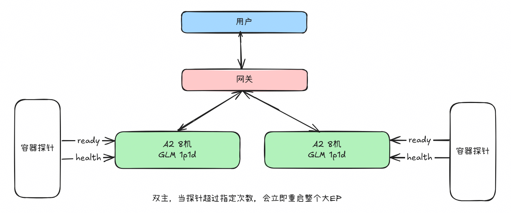

在上述ModelArts集群部署形态下，单EP实例内部的MindIE-Motor部署如下图：
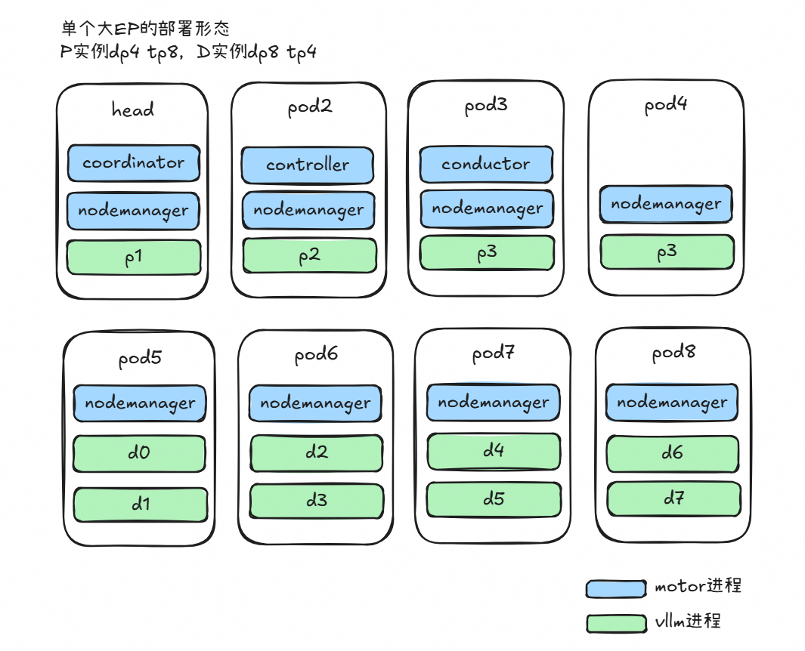

### 3.4.2 基于vllm镜像安装包准备

离线下载motor及其依赖，主要包含以下部分：

- motor whl包

- motor requirements.txt中的依赖

- libzmp

- pciutils

- motor源码，用于拷贝examples目录，将examples目录放到
  /mnt/obs/scripts/PyMotor路径下

### 3.4.3 基于motor镜像安装包准备

从容器中拷贝examples目录

将examples目录放到 /mnt/obs/scripts/PyMotor路径下

```bash
IMAGE="<镜像名或镜像ID>"
cid=$(docker create "$IMAGE")
docker cp "$cid:/tmp/motor/examples" /mnt/obs/scripts/PyMotor/examples
docker rm "$cid"

```

### 3.4.4 准备启动脚本

使用prepare.sh生成启动脚本，prepare.sh脚本内容如下

```bash
EXAMPLES_PATH="/mnt/obs/scripts/PyMotor/examples" # 主机examples部署脚本路径
CONFIGMAP_PATH="/mnt/obs/scripts/PyMotor/configmap" # 服务启动脚本路径，需挂载到容器内
USER_CONFIG_PATH="/mnt/obs/scripts/PyMotor/examples/infer_engines/vllm/models/GLM/5/user_config.json" # user_config.json路径
ENV_PATH="/mnt/obs/scripts/PyMotor/examples/infer_engines/vllm/models/GLM/5/env.json" # env.json路径
mkdir -p $CONFIGMAP_PATH
# 容器启动脚本boot.sh，其运行时会调用startup目录下其他脚本，需要将其统一拷贝到$CONFIGMAP_PATH目录下。
cp -f $EXAMPLES_PATH/deployer/startup/boot.sh $CONFIGMAP_PATH/boot.sh
cp -f $EXAMPLES_PATH/deployer/startup/common.sh $CONFIGMAP_PATH/common.sh
cp -f $EXAMPLES_PATH/deployer/startup/hccl_tools.py $CONFIGMAP_PATH/hccl_tools.py
cp -f $EXAMPLES_PATH/deployer/startup/mooncake_config.py $CONFIGMAP_PATH/mooncake_config.py
cp -f $EXAMPLES_PATH/deployer/startup/roles/* $CONFIGMAP_PATH/

# 将准备好的user_config.json和env.json配置文件拷贝到$CONFIGMAP_PATH目录下
[ ! -f "$CONFIGMAP_PATH/user_config.json" ] && cp -f $USER_CONFIG_PATH $CONFIGMAP_PATH/user_config.json
[ ! -f "$CONFIGMAP_PATH/env.json" ] && cp -f $ENV_PATH $CONFIGMAP_PATH/env.json
# 若环境变量已加载，但发生改动，需先清理旧的环境变量。
sed -i '/^function set_controller_env()/,/^}/d' $CONFIGMAP_PATH/controller.sh
sed -i '/^function set_coordinator_env()/,/^}/d' $CONFIGMAP_PATH/coordinator.sh
sed -i '/^function set_prefill_env()/,/^}/d' $CONFIGMAP_PATH/engine.sh
sed -i '/^function set_decode_env()/,/^}/d' $CONFIGMAP_PATH/engine.sh
sed -i '/^function set_common_env()/,/^}/d' $CONFIGMAP_PATH/common.sh
sed -i '/^function set_kv_pool_env()/,/^}/d' $CONFIGMAP_PATH/kv_pool.sh
sed -i '/^function set_kv_conductor_env()/,/^}/d' $CONFIGMAP_PATH/kv_conductor.sh
sed -i '/^function set_controller_env()/,/^}/d' $CONFIGMAP_PATH/all_combine_in_single_container.sh
sed -i '/^function set_coordinator_env()/,/^}/d' $CONFIGMAP_PATH/all_combine_in_single_container.sh
sed -i '/^function set_prefill_env()/,/^}/d' $CONFIGMAP_PATH/all_combine_in_single_container.sh
sed -i '/^function set_decode_env()/,/^}/d' $CONFIGMAP_PATH/all_combine_in_single_container.sh
sed -i '/^function set_kv_pool_env()/,/^}/d' $CONFIGMAP_PATH/all_combine_in_single_container.sh
sed -i '/^function set_kv_conductor_env()/,/^}/d' $CONFIGMAP_PATH/all_combine_in_single_container.sh
sed -i '/./,$!d' $CONFIGMAP_PATH/common.sh

# 加载user_config.json和env.json中的环境变量，并作用于容器启动脚本。
python $EXAMPLES_PATH/deployer/startup/set_env_docker.py --configmap_path $CONFIGMAP_PATH

```

### 3.4.5 修改user_config.json和env.json

模型：GLM5.1

硬件信息：A2 8机

user_config.json内容如下

```json
{
    "version": "v2.0",
    "motor_deploy_config": {
        "p_instances_num": 1,
        "d_instances_num": 1,
        "single_p_instance_pod_num": 4,
        "single_d_instance_pod_num": 4,
        "p_pod_npu_num": 8,
        "d_pod_npu_num": 8,
        "image_name": "mindie-motor-vllm:r0.17.0rc1-800I-A2-py311-lts-aarch64",
        "job_id": "mindie-motor",
        "hardware_type": "800I_A2",
        "env_path": "./conf/env.json",
        "weight_mount_path": "/mnt/cache/GLM-5.1-W8A8",
        "deploy_mode": "multi_deployment"
    },
    "motor_controller_config": {
        "api_config": {
            "controller_api_port": 2026
        }
    },
    "motor_coordinator_config": {
        "logging_config": {
            "log_level": "INFO"
        },
        "scheduler_config": {
            "deploy_mode": "cpcd_separate",
            "scheduler_type": "kv_cache_affinity"
        },
        "api_config": {
            "coordinator_api_infer_port": 1026,
            "coordinator_api_mgmt_port": 4026
        }
    },
    "motor_nodemanger_config": {},
    "motor_engine_prefill_config": {
        "engine_type": "vllm",
        "motor_nodemanger_config": {
            "api_config": {
                "node_manager_port": 3026
            }
        },
        "model_config": {
            "model_name": "glm51",
            "model_path": "/mnt/cache/GLM-5.1-W8A8",
            "npu_mem_utils": 0.92,
            "parallel_config": {
                "dp_size": 4,
                "tp_size": 8,
                "pp_size": 1,
                "enable_ep": true,
                "dp_rpc_port": 10521
            }
        },
        "engine_config": {
            "kv-events-config": {
                "publisher": "zmq",
                "enable_kv_cache_events": true,
                "endpoint": "tcp://*:5557",
                "topic": "kv-events",
                "replay_endpoint": "tcp://*:6667"
            },
            "enable-log-requests": true,
            "enable-expert-parallel": true,
            "enable-chunked-prefill": true,
            "enable-prefix-caching": true,
            "enable-prompt-tokens-details": true,
            "seed": 1024,
            "max-model-len": 202752,
            "max-num-batched-tokens": 4096,
            "trust-remote-code": true,
            "max-num-seqs": 32,
            "quantization": "ascend",
            "async-scheduling": true,
            "enforce-eager": true,
            "enable-auto-tool-choice": true,
            "tool-call-parser": "glm47",
            "default-chat-template-kwargs": {
                "enable_thinking": false
            },
            "speculative-config": {
                "num_speculative_tokens": 3,
                "method": "deepseek_mtp"
            },
            "additional-config": {
                "recompute_scheduler_enable": true,
                "multistream_overlap_shared_expert": true,
                "fuse_qknorm_rope": false,
                "fuse_muls_add": true,
                "enable_npugraph_ex": true,
                "layer_sharding": [
                    "q_b_proj",
                    "o_proj"
                ]
            },
            "kv_transfer_config": {
                "kv_connector": "MultiConnector",
                "engine_id": "0",
                "kv_role": "kv_producer",
                "kv_connector_extra_config": {
                    "connectors": [
                        {
                            "kv_connector": "MooncakeConnectorV1",
                            "kv_role": "kv_producer",
                            "kv_port": "30100",
                            "kv_connector_module_path": "vllm_ascend.distributed.mooncake_connector",
                            "kv_connector_extra_config": {
                                "use_ascend_direct": true,
                                "prefill": {
                                    "dp_size": 4,
                                    "tp_size": 8
                                },
                                "decode": {
                                    "dp_size": 8,
                                    "tp_size": 4
                                }
                            }
                        },
                        {
                            "kv_connector": "AscendStoreConnector",
                            "kv_role": "kv_producer",
                            "kv_connector_extra_config": {
                                "lookup_rpc_port": "10521",
                                "backend": "yuanrong"
                            }
                        }
                    ]
                }
            },
            "health_check_config": {
                "enable_virtual_inference": false,
                "npu_usage_threshold": 3,
                "max_failure_count": 6
            }
        }
    },
    "motor_engine_decode_config": {
        "engine_type": "vllm",
        "motor_nodemanger_config": {
            "api_config": {
                "node_manager_port": 3026
            }
        },
        "model_config": {
            "model_name": "glm51",
            "model_path": "/mnt/cache/GLM-5.1-W8A8",
            "npu_mem_utils": 0.92,
            "parallel_config": {
                "dp_size": 8,
                "tp_size": 4,
                "pp_size": 1,
                "enable_ep": true,
                "dp_rpc_port": 10521
            }
        },
        "engine_config": {
            "enable-log-requests": true,
            "enable-expert-parallel": true,
            "enable-chunked-prefill": true,
            "enable-prefix-caching": true,
            "enable-prompt-tokens-details": true,
            "seed": 1024,
            "max-model-len": 202752,
            "max-num-batched-tokens": 128,
            "trust-remote-code": true,
            "max-num-seqs": 48,
            "async-scheduling": true,
            "quantization": "ascend",
            "enable-auto-tool-choice": true,
            "tool-call-parser": "glm47",
            "default-chat-template-kwargs": {
                "enable_thinking": false
            },
            "speculative-config": {
                "num_speculative_tokens": 3,
                "method": "deepseek_mtp"
            },
            "compilation_config": {
                "cudagraph_capture_sizes": [
                    1,
                    4,
                    8,
                    16,
                    32,
                    48,
                    56,
                    64,
                    80,
                    96
                ],
                "cudagraph_mode": "FULL_DECODE_ONLY"
            },
            "additional-config": {
                "recompute_scheduler_enable": true,
                "multistream_overlap_shared_expert": true,
                "fuse_qknorm_rope": false,
                "fuse_muls_add": true,
                "enable_npugraph_ex": true
            },
            "kv_transfer_config": {
                "kv_connector": "MultiConnector",
                "kv_role": "kv_consumer",
                "kv_connector_extra_config": {
                    "connectors": [
                        {
                            "kv_connector": "MooncakeConnectorV1",
                            "kv_role": "kv_consumer",
                            "kv_port": "30100",
                            "kv_connector_module_path": "vllm_ascend.distributed.mooncake_connector",
                            "kv_connector_extra_config": {
                                "use_ascend_direct": true,
                                "prefill": {
                                    "dp_size": 4,
                                    "tp_size": 8
                                },
                                "decode": {
                                    "dp_size": 8,
                                    "tp_size": 4
                                }
                            }
                        },
                        {
                            "kv_connector": "AscendStoreConnector",
                            "kv_role": "kv_consumer",
                            "kv_connector_extra_config": {
                                "lookup_rpc_port": "10521",
                                "backend": "yuanrong"
                            }
                        }
                    ]
                }
            }
        }
    }
}

```

env.json内容如下

```json
{
  "version": "2.0.0",
  "motor_common_env": {
    "CANN_INSTALL_PATH": "/usr/local/Ascend",
    "MOTOR_LOG_ROOT_PATH": "/root/ascend/log"
  },
  "motor_controller_env": {},
  "motor_coordinator_env": {},
  "motor_engine_prefill_env": {
    "VLLM_LOGGING_LEVEL": "INFO",
    "VLLM_ASCEND_ENABLE_MLAPO": 1,
    "VLLM_ASCEND_ENABLE_NZ": 1,
    "HCCL_OP_EXPANSION_MODE": "AIV",
    "OMP_PROC_BIND": "false",
    "OMP_NUM_THREADS": 10,
    "VLLM_USE_V1": 1,
    "HCCL_BUFFSIZE": 256,
    "PYTORCH_NPU_ALLOC_CONF": "expandable_segments:True",
    "VLLM_ASCEND_BALANCE_SCHEDULING": 0,
    "TASK_QUEUE_ENABLE": 1,
    "CPU_AFFINITY_CONF": 1,
    "VLLM_ASCEND_ENABLE_FLASHCOMM1": 1,
    "ASCEND_AGGREGATE_ENABLE": 1,
    "ASCEND_TRANSPORT_PRINT": 1,
    "ACL_OP_INIT_MODE": 1,
    "VLLM_NIXL_ABORT_REQUEST_TIMEOUT": 300,
    "ASCEND_CONNECT_TIMEOUT": 300000,
    "ASCEND_TRANSFER_TIMEOUT": 300000,
    "ASCEND_BUFFER_POOL": "4:8",
    "HCCL_INTRA_ROCE_ENABLE": 1,
    "DS_H2D_MEMCPY_POLICY": "direct",
    "DS_D2H_MEMCPY_POLICY": "direct"
  },
  "motor_engine_decode_env": {
    "VLLM_LOGGING_LEVEL": "INFO",
    "VLLM_ASCEND_ENABLE_MLAPO": 1,
    "VLLM_ASCEND_ENABLE_NZ": 1,
    "HCCL_OP_EXPANSION_MODE": "AIV",
    "OMP_PROC_BIND": "false",
    "OMP_NUM_THREADS": 10,
    "VLLM_USE_V1": 1,
    "HCCL_BUFFSIZE": 512,
    "PYTORCH_NPU_ALLOC_CONF": "expandable_segments:True",
    "VLLM_ASCEND_BALANCE_SCHEDULING": 0,
    "TASK_QUEUE_ENABLE": 1,
    "CPU_AFFINITY_CONF": 1,
    "ASCEND_AGGREGATE_ENABLE": 1,
    "ASCEND_TRANSPORT_PRINT": 1,
    "ACL_OP_INIT_MODE": 1,
    "VLLM_NIXL_ABORT_REQUEST_TIMEOUT": 300,
    "ASCEND_CONNECT_TIMEOUT": 300000,
    "ASCEND_TRANSFER_TIMEOUT": 300000,
    "ASCEND_BUFFER_POOL": "4:8",
    "HCCL_INTRA_ROCE_ENABLE": 1,
    "DS_H2D_MEMCPY_POLICY": "direct",
    "DS_D2H_MEMCPY_POLICY": "direct"
  },
  "motor_kv_cache_pool_env": {},
  "motor_kv_conductor_env": {}
}

```

### 3.4.6 增加start_motor.sh脚本

作为motor启动的入口，主要作用如下：

- 离线安装motor依赖

- 设置环境变量

- 启动motor进程

start_motor.sh脚本内容如下：

```shell
# install dependency，$MOTOR_SCRIPT_PATH由上层脚本start.sh传递，如果使用的是motor镜像，可以不传递该变量
pip install --no-index --find-links=$MOTOR_SCRIPT_PATH/packages -r $MOTOR_SCRIPT_PATH/configmap/requirements.txt
# install pciutils
dpkg -i $MOTOR_SCRIPT_PATH/pciutils-offline/*.deb
# install libzmq
dpkg -i $MOTOR_SCRIPT_PATH/libzmq-offline/*.deb
# install motor
pip install $MOTOR_SCRIPT_PATH/MindIE-PyMotor/dist/motor-0.1.0-py3-none-any.whl
echo "pymotor install succeed"
# copy conductor
cp $MOTOR_SCRIPT_PATH/mooncake_conductor /usr/local/bin/
# export env
export CONFIGMAP_PATH=$MOTOR_SCRIPT_PATH/configmap
export CONFIG_PATH=$MOTOR_SCRIPT_PATH/configmap
export ROLE=$1
export COORDINATOR_SERVICE=$2
export CONTROLLER_SERVICE=$3
export POD_IP=$4
export MOTOR_LOG_ROOT_PATH=/mnt/cache/logs/
export JOB_NAME=$5
export KV_CONDUCTOR_SERVICE=$6
export KVP_MASTER_SERVICE=$7
# yuanrong
export DS_WORKER_ADDR="${POD_IP}:18481"
unset GOOGLE_LOGTOSTDERR GOOGLE_ALSOLOGTOSTDERR
source $CONFIGMAP_PATH/boot.sh
echo "start boot.sh"

```

在start.sh脚本中，调用start_motor.sh

```shell
# 其他内容省略...

# ============ 根据节点IP启动不同角色 ============
# p0 节点：coordinator + prefill
if [ "$host_IP" = "$P0" ]; then
    echo "p0 & coordinator"
    source $MOTOR_SCRIPT_PATH/start_motor.sh coordinator $P0 $P1 $P0 "coordinator" $P2 $P3 2>&1 | tee ${LOG_DIR}/coordinator.log &
    source $MOTOR_SCRIPT_PATH/start_motor.sh prefill $P0 $P1 $P0 "instance-p0" $P2 $P3 2>&1 | tee ${LOG_DIR}/p0.log
# p1 节点：controller + prefill
elif [ "$host_IP" = "$P1" ]; then
    echo "p1 & controller"
    source $MOTOR_SCRIPT_PATH/start_motor.sh controller $P0 $P1 $P1 "controller" $P2 $P3 2>&1 | tee ${LOG_DIR}/controller.log &
    source $MOTOR_SCRIPT_PATH/start_motor.sh prefill $P0 $P1 $P1 "instance-p0" $P2 $P3 2>&1 | tee ${LOG_DIR}/p1.log
# p2 节点：kv_conductor + prefill
elif [ "$host_IP" = "$P2" ]; then
    echo "p2 & kv_conductor"
    source $MOTOR_SCRIPT_PATH/start_motor.sh kv_conductor $P0 $P1 $P2 "kv_conductor" $P2 $P3 2>&1 | tee ${LOG_DIR}/kv_conductor.log &
    source $MOTOR_SCRIPT_PATH/start_motor.sh prefill $P0 $P1 $P2 "instance-p0" $P2 $P3 2>&1 | tee ${LOG_DIR}/p2.log
elif [ "$host_IP" = "$P3" ]; then
    echo "p3"
    source $MOTOR_SCRIPT_PATH/start_motor.sh prefill $P0 $P1 $P3 "instance-p0" $P2 $P3 2>&1 | tee ${LOG_DIR}/p3.log
elif [ "$host_IP" = "$D0" ]; then
    echo "d0"
    source $MOTOR_SCRIPT_PATH/start_motor.sh decode $P0 $P1 $D0 "instance-d0" $P2 $P3 2>&1 | tee ${LOG_DIR}/d0.log
elif [ "$host_IP" = "$D1" ]; then
    echo "d1"
    source $MOTOR_SCRIPT_PATH/start_motor.sh decode $P0 $P1 $D1 "instance-d0" $P2 $P3 2>&1 | tee ${LOG_DIR}/d1.log
elif [ "$host_IP" = "$D2" ]; then
    echo "d2"
    source $MOTOR_SCRIPT_PATH/start_motor.sh decode $P0 $P1 $D2 "instance-d0" $P2 $P3 2>&1 | tee ${LOG_DIR}/d2.log
elif [ "$host_IP" = "$D3" ]; then
    echo "d3"
    source $MOTOR_SCRIPT_PATH/start_motor.sh decode $P0 $P1 $D3 "instance-d0" $P2 $P3 2>&1 | tee ${LOG_DIR}/d3.log
fi

# 其他内容省略...

```

## 3.5 ETCD池化部署方案

### 3.5.1 部署方案介绍

在使用元戎的跨节点KV缓存池化方案中，需要使用ETCD作为中心管理节点，进行计算节点信息、业务数据信息的处理与转发。ETCD部署需要满足以下要求：

- 基于专属资源池(集群)粒度，可以纳管资源池内任意计算节点；

- 支持ETCD异常自恢复(进程级、容器级)；

- ETCD异常自恢复后，新拉起的ETCD外部访问标识不变更(IP/DNS/k8s
  service或其他)；

基于上述要求，部署方案制定为在MA资源租户内，使用CCE部署ETCD容器，ETCD间通过headless
service通信， 外部访问通过clusterIP实现；

### 3.5.2 部署脚本实现

etcd-all.yaml脚本实现如下，第22行镜像地址需根据实际镜像修改(字段：swr.cn...)

```yaml
apiVersion: apps/v1
kind: StatefulSet
metadata:
  labels:
    appgroup: ''
    version: v1
  name: etcd
  namespace: default
spec:
  selector:
    matchLabels:
      app: etcd
      version: v1
  template:
    metadata:
      labels:
        app: etcd
        version: v1
    spec:
      containers:
        - name: etcd-server
          image: swr.cn-southwest-2.myhuaweicloud.com/private-cs/etcd:v3.5.10
          command:
            - /usr/local/bin/etcd
          args:
            - --name=$(POD_NAME)
            - --data-dir=/tmp/etcd-yuanong
            - --listen-peer-urls=http://0.0.0.0:2380
            - --listen-client-urls=http://0.0.0.0:2379
            - --advertise-client-urls=http://$(POD_NAME).etcd-headless.default.svc.cluster.local:2379
            - --initial-advertise-peer-urls=http://$(POD_NAME).etcd-headless.default.svc.cluster.local:2380
            - --initial-cluster=etcd-0=http://etcd-0.etcd-headless.default.svc.cluster.local:2380,etcd-1=http://etcd-1.etcd-headless.default.svc.cluster.local:2380,etcd-2=http://etcd-2.etcd-headless.default.svc.cluster.local:2380
            - --initial-cluster-state=new
            - --initial-cluster-token=etcd-cluster-token
            - --auto-compaction-retention=1
          imagePullPolicy: Always
          env:
            - name: PAAS_APP_NAME
              value: etcd
            - name: PAAS_NAMESPACE
              value: default
            - name: POD_NAME
              valueFrom:
                fieldRef:
                  fieldPath: metadata.name
          resources:
            requests:
              cpu: 100m
              memory: 256Mi
            limits:
              cpu: 2000m
              memory: 8192Mi
          livenessProbe:
            tcpSocket:
              port: 2379
            initialDelaySeconds: 10
            periodSeconds: 10
            timeoutSeconds: 5
          readinessProbe:
            tcpSocket:
              port: 2379
            initialDelaySeconds: 5
            periodSeconds: 5
            timeoutSeconds: 5
          volumeMounts:
            - name: etcd-data
              readOnly: false
              mountPath: /tmp/etcd-yuanong
              subPath:
      imagePullSecrets:
        - name: default-secret
      affinity:
        podAntiAffinity:
          preferredDuringSchedulingIgnoredDuringExecution:
            - weight: 100
              podAffinityTerm:
                labelSelector:
                  matchExpressions:
                    - key: app
                      operator: In
                      values:
                        - etcd
                topologyKey: kubernetes.io/hostname
      terminationGracePeriodSeconds: 30
      dnsPolicy: ClusterFirst
      tolerations:
        - key: node.kubernetes.io/not-ready
          operator: Exists
          effect: NoExecute
          tolerationSeconds: 300
        - key: node.kubernetes.io/unreachable
          operator: Exists
          effect: NoExecute
          tolerationSeconds: 300
      initContainers: []
      volumes:
        - name: etcd-data
          hostPath:
            path: /tmp/etcd-yuanong
  serviceName: etcd-headless
  replicas: 3
  podManagementPolicy: OrderedReady
  revisionHistoryLimit: 10
  updateStrategy:
    type: RollingUpdate


---
apiVersion: v1
kind: Service
metadata:
  name: etcd-headless
  labels:
    app: etcd
    version: v1
  namespace: default
spec:
  selector:
    app: etcd
    version: v1
  clusterIP: None
  ports:
    - name: peer
      targetPort: 2380
      nodePort: 0
      port: 2380
      protocol: TCP


---
apiVersion: v1
kind: Service
metadata:
  name: etcd-client-service
  labels:
    app: etcd
    version: v1
  namespace: default
  annotations: {}
spec:
  selector:
    app: etcd
    version: v1
  ports:
    - name: cce-service-0
      targetPort: 2379
      nodePort: 0
      port: 2379
      protocol: TCP
  type: ClusterIP

```

# 4 健康检查配置

## 4.1 总体介绍

本教程的大EP部署场景中(ModelArts推理1.0)，包含以下健康检测能力：

- 就绪探针：周期性针对大模型服务进行就绪检测，探针失败超限后MA会重启推理服务容器，进行一次完整部署操作

- 存活探针：周期性针对大模型服务、元戎进行存活检测，探针失败超限后MA会重启推理服务容器，进行一次完整部署操作；

注意事项：

- 就绪探针中仅检查vllm服务状态

- 存活探针中检查vllm服务、元戎状态

- 就绪探针、存活探针任一失败超过最大次数均会触发MA服务重启

## 4.2 就绪探针检查脚本

就绪探针脚本不区分主从节点，命名vllm_probe.py，执行如下操作：

- 主、从节点识别(hostname中携带head字段则为主节点)；

- 在主节点构造http协议请求模型服务(v1/chat/comoletions)；

- 判断请求是否正确返回；

脚本实现如下：

```python
import sys
import subprocess
import requests
import socket
import logging
import json
logging.basicConfig(format='%(asctime)s [%(levelname)s] [%(filename)s:%(lineno)d] %(message)s',datefmt='%Y-%m-%d %H:%M:%S', level=logging.INFO, filename='/mnt/cache/health_check_probe.log', filemode='a')

if __name__ == "__main__":

    # only master node has this resource. For slave node, do not check vllm process.
    hostname = socket.gethostname()
    if "head" not in hostname:
        logging.debug(f"node {hostname} is not head, do not need probe")
        sys.exit(0)
    logging.info("health check start")

    local_ip = socket.gethostbyname(hostname)
    api_url = f"http://{local_ip}:1025/v1/chat/completions"

    headers = {
        'Content-Type': 'application/json',
    }
    request_data = {
        "model": "glm51",
        "messages": [{"role": "user", "content": "hello"}],
        "stream": False,
        "max_tokens": 2,
        "temperature": 0.6,
        "chat_template_kwargs":{"enable_thinking":False}
    }

    try:
        response = requests.post(
            api_url,
            json=request_data,
            headers=headers,
            stream=False,
            timeout=1200
        )
    except Exception as e:
        logging.error(f"requests post failed, Exception: {e}")
        sys.exit(1)

    if response.status_code != 200:
        logging.error(f"Response error, status code: {response.status_code}, text: {response.text}")
        sys.exit(1)

    try:
        response_info = json.loads(response.text)
        if len(response_info['choices'][0]['message']['content']) == 0:
            logging.error("response content len is 0")
            sys.exit(1)
    except Exception as e:
        logging.error(f"json parse failed, text: {response.text}, Exception: {e}")
        sys.exit(1)

    logging.info(f"health check success, response: {response.text}")

```

## 4.3 存活探针检查脚本

存活探针脚本不区分主从节点，命名vllm_probe_yr.py，执行如下操作：

- 执行元戎健康检查

- 主、从节点识别(hostname中携带head字段则为主节点)；

- 在主节点构造http协议请求模型服务(v1/chat/comoletions)；

- 判断请求是否正确返回；

注意事项：脚本依赖的文件utils.sh，需要手动上传至脚本同目录下,utils.sh脚本实现如下：

```bash
#!/bin/bash
set -e

shopt -s expand_aliases

readonly UTILS_WORK_DIR=$(dirname "$(readlink -f "$0")")
readonly UTILS_LOG_FILE=${WORKER_LOG_DIR}/container.log
readonly UTILS_LOCK_FILE=${WORKER_LOG_DIR}/.loglock
readonly UTILS_LOCK_DIR=${WORKER_LOG_DIR}/.loglockdir
readonly UTILS_MAX_LOG_SIZE=10485760 # not 10MB
readonly UTILS_MAX_LOG_COUNT=9 # not include the current log file.
readonly UTILS_POD_NAME=${POD_NAME:-$(hostname)}
readonly UTILS_PREFIX=${UTILS_LOG_FILE%.*}
readonly UTILS_SUFFIX=${UTILS_LOG_FILE#*.}

alias ilog='utils_log I ${BASH_SOURCE##*/}:${LINENO}'
alias wlog='utils_log W ${BASH_SOURCE##*/}:${LINENO}'
alias elog='utils_log E ${BASH_SOURCE##*/}:${LINENO}'

function utils_log_impl() {
    echo -e "$(date -u '+%Y-%m-%dT%H:%M:%S.%6N') $1 | $2 | ${UTILS_POD_NAME} | $$ |   | $3" >> ${UTILS_LOG_FILE}
    if [ "$1" == "E" -o "$1" == "W" ]; then
        echo -e "$3" >&2
    fi
}

function utils_rm_logfile() {
    local files=($(ls ${UTILS_PREFIX}.*.${UTILS_SUFFIX}))
    local to_del_count=$((${#files[@]} - ${UTILS_MAX_LOG_COUNT}))
    for file in "${files[@]}"; do
        if [ ${to_del_count} -lt 1 ]; then
            break
        fi
        to_del_count=$((to_del_count-1))
        utils_log_impl I ${BASH_SOURCE##*/}:${LINENO} "rm log file ${file}"
        rm ${file}
    done
}

# rotate the logs if log file exceeds the max size
function utils_rotate_logfile() {
    local cur_time_str=$(date -u "+%Y%m%d%H%M%S")
    local new_log_file=${UTILS_PREFIX}.${cur_time_str}.${UTILS_SUFFIX}
    local file_size=$((du -b ${UTILS_LOG_FILE} 2>/dev/null || echo 0) | awk '{print $1}')
    if [ ${file_size} -gt ${UTILS_MAX_LOG_SIZE} ]; then
        mv ${UTILS_LOG_FILE} ${new_log_file}
        touch ${UTILS_LOG_FILE}
        touch ${UTILS_LOG_FILE}
        utils_rm_logfile
    fi
}

function utils_trylock_exec() {
    local cmd="$1"
    if command -v flock >/dev/null 2>&1; then
        flock -n ${UTILS_LOCK_FILE} -c "$cmd"
    else
        # using create dir to simulate flock.
        if mkdir "${UTILS_LOCK_DIR}" 2>/dev/null; then
            ${cmd} || true
            rmdir "${UTILS_LOCK_DIR}"
        else
            # remove dir if the lock dir was created 30s ago.
            local current_time=$(date +%s)
            local update_time=$(stat -c %Z ${UTILS_LOCK_DIR} 2>/dev/null || echo ${current_time})
            local timeout=30
            if [ $((current_time - update_time)) -gt ${timeout} ]; then
                utils_log_impl I ${BASH_SOURCE##*/}:${LINENO} "rm timeout lock dir ${UTILS_LOCK_DIR}"
                rmdir "${UTILS_LOCK_DIR}" 2>/dev/null
            fi
        fi
    fi
}

function utils_log() {
    utils_log_impl "$@"
    local file_size=$((du -b ${UTILS_LOG_FILE} 2>/dev/null || echo 0) | awk '{print $1}')
    if [ ${file_size} -gt ${UTILS_MAX_LOG_SIZE} ]; then
        utils_trylock_exec "bash ${UTILS_WORK_DIR}/utils.sh ROTATE_LOG" || true
    fi
    chmod 640 ${UTILS_LOG_FILE} 2>/dev/null || true
}

if [ "${1}" == "ROTATE_LOG" ]; then
    utils_rotate_logfile
fi
```

存活探针脚本vllm_probe_yr.py实现如下：

```python

import sys
import subprocess
import requests
import socket
import logging
import json

logging.basicConfig(format='%(asctime)s [%(levelname)s][%(filename)s:%(lineno)d] %(message)s',
                    datefmt='%Y-%m-%d %H:%M:%S', level=logging.INFO, filename='/mnt/cache/health_check_probe.log', filemode='a')

if __name__ == "__main__":
    # check yuanrong
    try:
        ret = subprocess.run(["bash", "/workspace/scripts/health_check/yr_liveness_check.sh"])
        if ret.returncode == 1:
            logging.error(f"yuanrong check fail !")
            sys.exit(1)
    except Exception as e:
        logging.error(f"yuanrong check failed, Exception: {e}")
        sys.exit(1)

    logging.info(f"yuanrong check success !")

    # only master node has response. For slave node, do not check vllm and ETCD process.
    hostname = socket.gethostname()
    if "head" not in hostname:
        logging.debug(f"node {hostname} is not head, do not need probe")
        sys.exit(0)

    logging.info(f"health check start")

    local_ip = socket.gethostbyname(hostname)

    api_url = f"http://{local_ip}:1026/v1/chat/completions"

    headers = {
        'Content-Type': 'application/json',
    }

    request_data = {
        "model": "glm51",
        "messages": [{"role": "user", "content": "hello"}],
        "stream": False,
        "max_tokens": 2,
        "temperature": 0.6,
        "chat_template_kwargs": {"enable_thinking": False}
    }

    try:
        response = requests.post(
            api_url,
            json=request_data,
            headers=headers,
            stream=False,
            timeout=1200
        )
    except Exception as e:
        logging.error(f"requests.post failed, Exception: {e}")
        sys.exit(1)

    if response.status_code != 200:
        logging.error(f"response error, status_code: {response.status_code}, text: {response.text}")
        sys.exit(1)

    try:
        response_info = json.loads(response.text)
        if len(response_info['choices'][0]['message']['content']) == 0:
            logging.error(f"response content len is 0")
            sys.exit(1)
    except Exception as e:
        logging.error(f"json parse failed, text: {response.text}, Exception: {e}")
        sys.exit(1)

    logging.info(f"health check success, response: {response.text}")
```

## 4.4 关键注意事项

1. 健康检查脚本只有正常返回sys.exit(0)值，才代表执行成功；而返回sys.exit(1)或者抛error等，都代表健康检查失败，可在收到执行完检查后，通过echo
    \$?命令，查看刚刚脚本退出值，只有0才正确，并且应当有success答应（仅手动调试过程中有）。

2. 如何判断有无执行健康检查：vllm后台日志可以看到200
    OK返回字样，标志已经收到健康检查请求（但不代表判断success）。

3. 执行健康检查报无法识别"\\r"命令：先尝试dos2unix
    utils.sh，如果容器报错无dos2unix指令，则使用以下指令: sed -i
    "s/\\r//"utils.sh，该命令为将文件中所有\\r字符替换为空白。

# 5 测试指导

## 5.1 基于vLLM bench serve性能测试

### 5.1.1 手动快速测试

使用vllm bench serve对已启动的OpenAI兼容服务进行快速压测，脚本示例如下：

```bash
BENCH_HOST=127.0.0.1
BENCH_PORT=1026
TOKENIZER_PATH=/mnt/cache/GLM-5.1-W8A8
vllm bench serve \
--backend openai-chat \
--endpoint /v1/chat/completions \
--dataset-name prefix_repetition \
--prefix-repetition-prefix-len 31744 \
--prefix-repetition-suffix-len 1024 \
--prefix-repetition-output-len 2048 \
--num-prompts 100 \
--prefix-repetition-num-prefixes 5 \
--ignore-eos \
--model glm-5 \
--tokenizer $TOKENIZER_PATH \
--seed 1000 \
--host $BENCH_HOST \
--port $BENCH_PORT \
--max-concurrency 10
```

参数含义如下：

| 配置参数 | 配置作用 |
|------|------|
|--backend|指定测试的后端接口类型。
|--endpoint|指定压测请求发送的具体API路径。
|--dataset-name|选择压测使用的数据集类型。
|--prefix-repetition-prefix-len|在前缀重复模式下，公共前缀的Token长度。
|--prefix-repetition-suffix-len|紧跟在公共前缀后面的非重复后缀的Token长度。
|--prefix-repetition-output-len|指定模型生成回答的目标Token长度。
|--num-prompts|总共发送的压测请求（Prompt）数量。
|--prefix-repetition-num-prefixes|包含多少种不同的公共前缀数量。
|--ignore-eos|强制模型忽略结束符。
|--model|指定被测试的模型名称。
|--tokenizer|压测客户端计算Token时使用的分词器路径。
|--seed|随机数种子。
|--host|指定压测服务自身运行的IP地址。
|--port|指定压测服务自身运行的端口。
|--max-concurrency|最大并发请求数

### 5.1.2 自动深度测试

通过已构建的shell自动化脚本，调用vllm bench
serve能力对模型进行深度自动化压测、性能测试。自动化脚本可灵活组合测试并发数、输入长度、前缀重复比例、输出长度、测试数据集大小等。测试过程中脚本通过vllm
metrics能力获取前缀命中block数等关键指标，并处理整合为csv文件输出。

自动化测试脚本vLLM_bench_template.sh实现如下：

```bash
#!/usr/bin/env bash
# 脚本执行指令：nohup bash vLLM_bench_template.sh  </dev/null > /mnt/obs/scripts/test/vllm_bench/output/runtime.log 2>&1 &
set -euo pipefail

# ==========================================
# 1. 配置测试环境与模型服务信息
# ==========================================
BENCH_HOST="${BENCH_HOST:-172.16.0.148}"
BENCH_PORT="${BENCH_PORT:-1026}"
METRICS_PORT="${METRICS_PORT:-4026}"
TOKENIZER_PATH="${TOKENIZER_PATH:-/mnt/cache/GLM-5.1-W8A8}"

OUTPUT_DIR="/mnt/obs/scripts/test/vllm_bench/output/vLLM_bench_test_$(date +%Y%m%d_%H%M)"
mkdir -p ${OUTPUT_DIR}

METRIC_DIR="${OUTPUT_DIR}/bench_metrics"
CSV_FILE="${OUTPUT_DIR}/bench_prefix_cache_summary.csv"

mkdir -p "${METRIC_DIR}"
METRICS_URL="http://${BENCH_HOST}:${METRICS_PORT}/metrics"

MODEL_NAME="${MODEL_NAME:-glm51}"

# ==========================================
# 2. 配置测试矩阵与固定控制参数
# ==========================================
# 并发请求数组合设置
CONCURRENCY_LIST=(8 16 32 48 64)
# 输入长度组合设置
INPUT_LENGTH_LIST=(32768 65536 131072 163840 190000)
# 输出长度组合设置
OUTPUT_LENGTH_LIST=(1024 2048 4096 8192)
# 输出长度组合
TOTAL_ROUNDS=$(( ${#CONCURRENCY_LIST[@]} * ${#INPUT_LENGTH_LIST[@]} * ${#OUTPUT_LENGTH_LIST[@]} ))
CURRENT_ROUND=0

# 重复前缀比例设置（整数，范围 1-99，默认 90 表示 90%）
PREFIX_RATIO="${PREFIX_RATIO:-90}"
# 动态计算后缀比例
SUFFIX_RATIO=$(( 100 - PREFIX_RATIO ))
# 每轮测试数据集大小设置
NUM_PROMOTS="${NUM_PROMOTS:-200}"
# 数据集重复前缀种类数量设置
PREFIX_REPETITION_NUM="${PREFIX_REPETITION_NUM:-10}"

echo "=========================================================="
echo " 开始 vLLM 90% 前缀复用矩阵压测 | 总计划测试轮数: ${TOTAL_ROUNDS}"
echo " 并发维度: [${CONCURRENCY_LIST[*]}]"
echo " 输入长度: [${INPUT_LENGTH_LIST[*]}]"
echo " 输出长度: [${OUTPUT_LENGTH_LIST[*]}]"
echo "=========================================================="

# ==========================================
# 3. 双重循环执行测试
# ==========================================
for CONC in "${CONCURRENCY_LIST[@]}"; do
    for TOTAL_LEN in "${INPUT_LENGTH_LIST[@]}"; do
        for OUT_LEN in "${OUTPUT_LENGTH_LIST[@]}"; do
            CURRENT_ROUND=$((CURRENT_ROUND + 1))

            # 根据PREFIX_RATIO动态计算前缀长度与后缀长度
            PREFIX_LEN=$(( TOTAL_LEN * PREFIX_RATIO / 100 ))
            SUFFIX_LEN=$(( TOTAL_LEN - PREFIX_LEN ))

            # 为每一轮生成唯一的 SEED 隔离标识
            SEED=$(date +%s)_${CONC}_${TOTAL_LEN}_${OUT_LEN}

            BEFORE_FILE="${METRIC_DIR}/metrics_before_round_${CURRENT_ROUND}.txt"
            AFTER_FILE="${METRIC_DIR}/metrics_after_round_${CURRENT_ROUND}.txt"

            echo ""
            echo ">> [第 ${CURRENT_ROUND}/${TOTAL_ROUNDS} 轮] 并发=${CONC} | 输入长度=${TOTAL_LEN} | 输出长度=${OUT_LEN}"
            echo "   -> [${PREFIX_RATIO}%] 公共前缀: ${PREFIX_LEN} | [${SUFFIX_RATIO}%] 动态后缀: ${SUFFIX_LEN}"
            echo ""

            # 采集压测前指标
            if ! curl -s --max-time 5 "${METRICS_URL}" > "${BEFORE_FILE}"; then
                echo "❌ 错误: 无法连接到 vLLM 监控, 跳过本轮测试..."
                continue
            fi

            TIMESTAMP=$(date +%H%M%S)

            # 执行当前维度的压测
            vllm bench serve \
              --backend openai-chat \
              --endpoint /v1/chat/completions \
              --dataset-name prefix_repetition \
              --prefix-repetition-prefix-len "${PREFIX_LEN}" \
              --prefix-repetition-suffix-len "${SUFFIX_LEN}" \
              --prefix-repetition-output-len "${OUT_LEN}" \
              --num-prompts "${NUM_PROMOTS}" \
              --prefix-repetition-num-prefixes "${PREFIX_REPETITION_NUM}" \
              --ignore-eos \
              --model "${MODEL_NAME}" \
              --tokenizer "${TOKENIZER_PATH}" \
              --seed "$(date +%s)" \
              --host "${BENCH_HOST}" \
              --port "${BENCH_PORT}" \
              --max-concurrency "${CONC}" \
              > ${OUTPUT_DIR}/bench_${TIMESTAMP}_${SEED}.log 2>&1

            echo "⏳ 等待 5 秒确保 Prometheus 异步计数器落盘..."
            sleep 5

            # 采集压测后指标
            curl -s --max-time 5 "${METRICS_URL}" > "${AFTER_FILE}"

# ==========================================
# 4. 解析指标并追加到统一的 CSV 报表
# ==========================================
python3 - <<EOF
import re
import csv
from pathlib import Path

before_file = Path("${BEFORE_FILE}")
after_file = Path("${AFTER_FILE}")
csv_file = Path("${CSV_FILE}")

def collect_metric(path):
    values = {
        "local_queries": 0.0, "local_hits": 0.0,
        "ext_queries": 0.0, "ext_hits": 0.0
    }
    if not path.exists(): return values

    text = path.read_text()
    for line in text.splitlines():
        line = line.strip()
        if not line or line.startswith("#"): continue

        # 过滤掉特殊的 _created 时间戳指标，只看数据本身
        if "_created" in line:
            continue

        # 提取行尾的浮点数/整数
        match_val = re.search(r'([0-9.]+(?:[eE][+-]?[0-9]+)?)\s*$', line)
        if not match_val: continue
        val = float(match_val.group(1))

        # 兼容冒号和下划线，精准匹配 vLLM 核心的 _total 指标
        if re.search(r'vllm[:_]prefix_cache_queries(_total)?', line):
            values["local_queries"] += val
        elif re.search(r'vllm[:_]prefix_cache_hits(_total)?', line):
            values["local_hits"] += val
        elif re.search(r'vllm[:_]external_prefix_cache_queries(_total)?', line):
            values["ext_queries"] += val
        elif re.search(r'vllm[:_]external_prefix_cache_hits(_total)?', line):
            values["ext_hits"] += val

    return values

before = collect_metric(before_file)
after = collect_metric(after_file)

# 计算压测期间的纯增量 (Delta)
prefix_queries = max(0.0, after["local_queries"] - before["local_queries"])
prefix_hits = max(0.0, after["local_hits"] - before["local_hits"])
external_queries = max(0.0, after["ext_queries"] - before["ext_queries"])
external_hits = max(0.0, after["ext_hits"] - before["ext_hits"])

prefix_hit_rate = round(prefix_hits / prefix_queries, 4) if prefix_queries > 0 else "N/A"
external_hit_rate = round(external_hits / external_queries, 4) if external_queries > 0 else "N/A"

row = {
    "test_round": "${CURRENT_ROUND}",
    "concurrency": "${CONC}",
    "max_model_length": "${TOTAL_LEN}",
    "prefix_len": "${PREFIX_LEN}",
    "suffix_len": "${SUFFIX_LEN}",
    "output_len": "${OUT_LEN}",
    "prefix_queries_delta": int(prefix_queries),
    "prefix_hits_delta": int(prefix_hits),
    "prefix_hit_rate": prefix_hit_rate,
    "external_prefix_queries_delta": int(external_queries),
    "external_prefix_hits_delta": int(external_hits),
    "external_prefix_hit_rate": external_hit_rate,
}

write_header = not csv_file.exists()
with csv_file.open("a", newline="") as f:
    writer = csv.DictWriter(f, fieldnames=row.keys())
    if write_header: writer.writeheader()
    writer.writerow(row)

print(f"📊 [Round ${CURRENT_ROUND}] 本地命中率: {row['prefix_hit_rate']} | 外部命中率: {row['external_prefix_hit_rate']}")
print(f"   (DEBUG 绝对值 -> 本地Q/H: {int(after['local_queries'])}/{int(after['local_hits'])} | 外部Q/H: {int(after['ext_queries'])}/{int(after['ext_hits'])})")
EOF

            # 针对长文本的防御性休眠策略
            if [ $CURRENT_ROUND -lt $TOTAL_ROUNDS ]; then
                echo "💤 显存保护: 深度休眠 10 秒, 避免超长文本显存残留导致 OOM..."
                sleep 10
            fi

        done
    done
done

echo ""
echo "=========================================================="
echo "  ✅ ${PREFIX_RATIO}% 前缀复用比例矩阵测试全部完成!"
echo "  📁 结果汇总报表已保存至: ${CSV_FILE}"
echo "=========================================================="
```

## 5.2 基于ais_bench精度测试

本指导使用ais_bench对模型服务进行精度测试，主要使用gpqa、aime等测试数据集，基于ais_bench在github或gitee开源仓的使用指导构建即可。工具使用指导请参考：https://github.com/AISBench/benchmark/blob/master/README.md

# 6 FAQ-关键问题

1. 压测过程中MA就绪/存活探针检查失败：

   待服务恢复后导出健康检查日志，确认探针检查是否已最大失败次数，并调整最大失败次数、超时时间。就绪探针、存活探针任一失败均会触发MA重调度恢复机制。

2. 使用MindIE-Motor调度替换vllm proxy后，TTFT存在较大劣化：

   请检查P实例配置参数max_completions_tokens是否为1，PD分离场景下该值超过1会导致性能非预期劣化。

3. 启动或运行中报错ETCD连接失败：

   容器内输入以下指令，检查ETCD状态是否正常：etcdctl \--endpoints
   \"\${ETCD_IP}:2379\" endpoint health

4. 元戎KV cache命中率非预期为0：

   进入容器验证PYTHONHASHSEED与启动设置参数一致：echo \$PYTHONHASHSEED

5. 相同健康检查实现，在GLM模型服务可正常使用，切换至deepseek或其他模型服务MA报错健康检查失败：

   通过Post访问vllm的/v1/chat/completion接口获取正常返回值来判断服务健康状况时，要注意请求体、返回格式与特定模型的匹配，如：DeepSeek的思考模式为content中"\<think\>xxxx\<\\think\>"格式，而GLM5等模型的思考过程在reasonning_content字段中。建议再部署GLM系列模型的健康探针请求体中，增加\"chat_template_kwargs\":
   {\"enable_thinking\": False}
   字段，关闭思考模式，确保返回内容在"content"字段中。

6. 创建MA模型服务新版本，拷贝其他页面健康检查指令后，服务启动报错：

   须注意健康检查命令前没有多余空格(例如python
   xxx指令，python之前无空格)，如果通过拷贝方式，一定会造成该问题，务必规避。
