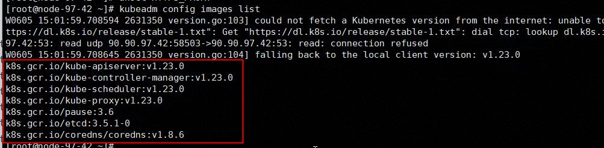
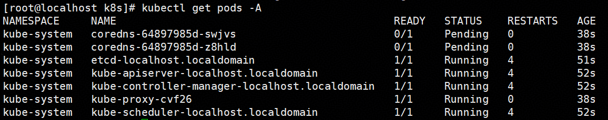
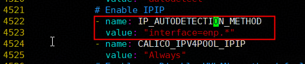
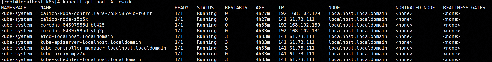
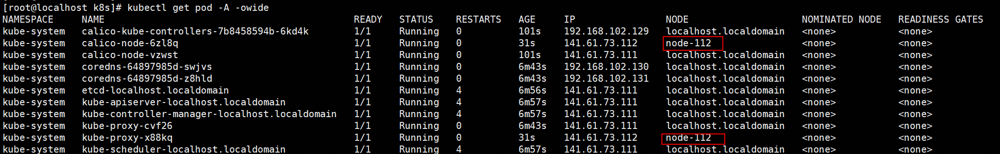
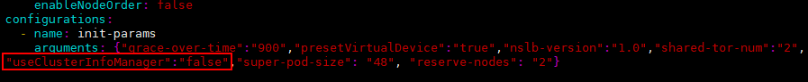

# 环境准备

## 依赖说明

MindIE Motor 依赖 Kubernetes 提供的容器编排能力，包括 Pod 部署、服务暴露、健康探针与故障重启，从而保证服务的安全运行；同时依赖 MindCluster 提供昇腾集群调度能力，实现NPU 资源调度、故障自动恢复等功能。其部署示意图如[图1 K8s集群整体部署视图](#fig698114995216)所示，依赖的具体组件名称及功能说明如[表1 依赖列表](#table9819144513712)所示。

**图 1**  K8s集群整体部署视图<a name="fig698114995216"></a>


**表 1**  依赖列表<a name="table9819144513712"></a>

|依赖包|软件说明|管理节点（master节点）是否安装|计算节点（worker节点）是否安装|
|--|--|--|--|
|**Kubernetes**|-|-|-|
|kubectl|Kubernetes的命令行工具。|Y|N|
|kubeadm|创建和管理Kubernetes集群工具。|Y|Y|
|kubelet|在集群中的每个节点上用来启动容器。|Y|Y|
|**MindCluster**|-|-|-|
|Ascend Device Plugin|基于Kubernetes设备插件机制，提供昇腾AI处理器的设备发现、分配和健康状态上报功能，使能Kubernetes管理昇腾AI处理器资源。需安装Ascend Docker Runtime后方可使用。|Y|Y|
|ClusterD|使用整卡调度、静态vNPU调度、动态vNPU调度、断点续训、弹性训练、推理卡故障恢复或推理卡故障重调度的用户，必须安装ClusterD。|Y|N|
|Volcano|基于开源Volcano调度插件机制，增加昇腾AI处理器的亲和性调度、故障重调度等特性，最大化发挥昇腾AI处理器计算性能。|Y|N|
|Ascend Docker Runtime|提供docker或containerd的昇腾容器化支持，自动挂载所需文件和设备依赖。|Y|Y|
|Infer Operator|创建推理实例Workload与Service，提供推理实例的手动扩缩容能力。|Y|N|

---

## Kubernetes安装

基于镜像源安装 Kubernetes。当前支持自动化脚本安装和手动安装两种方式，推荐使用自动化脚本进行安装。也可参考 [Kubernetes 官网](https://kubernetes.io/zh-cn/docs/setup/) 进行安装。

---

### 前置检查

1. 已预先安装docker。

2. 查看docker配置。

    ```bash
    vim /etc/docker/daemon.json
    ```

    检查必配项（配置完成后直接保存）
    - 查看"exec-opts"配置项，必须为native.cgroupdriver=systemd；
    - 查看"insecure-registries"配置项，必须包含swr.cn-north-4.myhuaweicloud.com、registry.cn-hangzhou.aliyuncs.com。
    - 示例如下（未说明项目不做要求）

    ```bash
    {
    "default-runtime": "ascend",
    "exec-opts": [
    "native.cgroupdriver=systemd"
    ],
    "insecure-registries": [
    "registry.cn-hangzhou.aliyuncs.com",
    "swr.cn-north-4.myhuaweicloud.com"
    ],
    "registry-mirrors": [
    "https://ascendhub.huawei.cn",
    "https://quay.io",
    "https://cr.rnd.huawei.com"
    ]
    }
    ```

3. 配置docker代理。

    ```bash
    # 备份旧的代理
    mkdir -p /etc/systemd/system/docker.service.d/backup
    mv /etc/systemd/system/docker.service.d/*.conf /etc/systemd/system/docker.service.d/backup/ 2>/dev/null

    # 设置新代理，请配置有效的网络代理
    cat > /etc/systemd/system/docker.service.d/http-proxy.conf << 'EOF'
    [Service]
    Environment="HTTP_PROXY=xxxx"
    Environment="HTTPS_PROXY=xxxx"
    Environment="NO_PROXY=xxxx"
    EOF
    ```

    验证配置是否生效。

    ```bash
    # 重启docker
    systemctl daemon-reload
    systemctl restart docker
    # 必须能看到 HTTP_PROXY、HTTPS_PROXY
    systemctl show docker --property=Environment
    ```

4. 检查存储空间，必须保证根目录已用空间小于85%，否则可能发生镜像丢失。

    ```bash
    # 查看服务器硬盘空间
    df -h
    ```

---

### 自动安装（推荐）

脚本默认安装 1.23.0 版本的 kubernetes、3.24.5 版本的 calico，该版本组合能够支持 motor 的正常部署。

1. 准备脚本。

    当前目录下准备了k8s的[安装脚本](./deployment/k8s/deployment_script)，将该文件夹直接拷贝至需要安装服务器。

2. 配置参数。

    修改脚本配置文件env.conf，需要配置内容如下。

      ```bash
      # 当前节点 IP
      HOST_IP="141.61.73.111"

    # Calico 网卡自动探测正则表达式
    # 查询主网卡命令：ip route | grep default
    #
    # 原理说明：
    # calico会运行在集群中的每一个服务器上（只在管理节点配置calico，该配置会应用于集群中的所有节点），因此，述表达式要保证calico能够在集群中的每台服务器都找到网卡：
    # 如果整个集群所有节点的主网卡名称(通过ip route | grep default查找)前缀相同，例如：集群各节点主网卡名称分别为enp1（master）、enp2（worker1节点）、enp115235(worker节点2)，可以填写为enp.*。
    # 如果各节点主网卡名称不一致，需用 | 把各节点的命名规则都写进表达式。例如：多数节点主网卡为 enp 开头，个别节点主网卡 virbr0 上，可填写为 enp.*|virbr0。
      IP_AUTODETECTION_IFACE="xxx"

      # ---------- 网络代理（可选；脚本会先测直连、再测代理，哪条通用哪条） ----------
      HTTP_PROXY="http://90.255.12.94:6666"
      HTTPS_PROXY="http://90.255.12.94:6666"
      NO_PROXY="127.0.0.1,localhost,10.0.0.0/8,192.168.0.0/16,141.61.0.0/16"
      ```

3. 预检查。

    执行以下命令，脚本将检测：docker配置、窗口网络连通性、docker网络连通性、根目录使用率。如果检查不通过，请排查环境对应功能是否正常。

      ```bash
      source env.conf && sudo -E bash deploy_k8s.sh precheck
      ```

4. 正式安装。

    脚本会自动执行「手动安装」小节的所有操作，如出现错误，请结合日志信息排查环境问题。

      ```bash
      # 管理节点
      source env.conf && sudo -E bash deploy_k8s.sh master
      # 计算节点
      source env.conf && sudo -E bash deploy_k8s.sh worker
      ```

    安装完毕后，无需关注[手动安装]小节，直接跳转至「创建集群」章节。

---

### 手动安装

1. 获取kubernetes组件。

    在服务器命令行中执行安装代码，可以修改安装代码以指定安装版本（例如：yum install -y **kubelet-1.23.0-00** **kubeadm-1.23.0-00** **kubectl-1.23.0-00**），以openEuler操作系统、ARM架构为例（其余操作系统和架构可视情况修改镜像源），整体安装命令示例如下。

      ```bash
      # 备份旧的源仓库，避免干扰
      mkdir -p /etc/yum.repos.d/disabled
      mv /etc/yum.repos.d/*.repo /etc/yum.repos.d/disabled/ 2>/dev/null

      # 设置源仓库
      cat > /etc/yum.repos.d/openEuler-huawei.repo << 'EOF'
      [openEuler-everything]
      name=openEuler Everything
      baseurl=https://repo.huaweicloud.com/openeuler/openEuler-24.03-LTS-SP2/everything/aarch64/
      enabled=1
      gpgcheck=0
      EOF

      cat > /etc/yum.repos.d/kubernetes.repo << 'EOF'
      [kubernetes]
      name=Kubernetes
      baseurl=http://mirrors.aliyun.com/kubernetes/yum/repos/kubernetes-el7-aarch64/
      enabled=1
      gpgcheck=0
      EOF

      # 开始安装
      yum install -y kubelet-1.23.0-00 kubeadm-1.23.0-00 kubectl-1.23.0-00
      ```

    >[!NOTE]注意
    >安装前必须挂载代理。
    >安装完成后请根据需要将/etc/yum.repos.d/disabled文件夹下的源仓库复原。

2. 安装Kubernetes的依赖。

    ```bash
    unset http_proxy
    unset https_proxy
    unset HTTP_PROXY
    unset HTTPS_PROXY
    kubeadm config images list
    ```

    >[!NOTE]注意
    >执行上述命令时必须卸载代理，否则可能导致后续版本不匹配。

    查询结果如下图所示。

    **图 3**  镜像结果示例<a name="fig17764145015239"></a>

    

    需要获取上图中的所有镜像，以下提供两种镜像获取方式：
    >
    >```bash
    >#方案一（推荐）：使用阿里云镜像仓库
    >#拉取镜像
    >docker pull registry.cn-hangzhou.aliyuncs.com/google_containers/kube-apiserver:v1.23.0
    >docker pull registry.cn-hangzhou.aliyuncs.com/google_containers/kube-controller-manager:v1.23.0
    >docker pull registry.cn-hangzhou.aliyuncs.com/google_containers/kube-scheduler:v1.23.0
    >docker pull registry.cn-hangzhou.aliyuncs.com/google_containers/kube-proxy:v1.23.0
    >docker pull registry.cn-hangzhou.aliyuncs.com/google_containers/pause:3.6
    >docker pull registry.cn-hangzhou.aliyuncs.com/google_containers/etcd:3.5.1-0
    >docker pull registry.cn-hangzhou.aliyuncs.com/google_containers/coredns:v1.8.6
    >
    >#重命名
    >docker tag registry.cn-hangzhou.aliyuncs.com/google_containers/kube-apiserver:v1.23.0           k8s.gcr.io/kube-apiserver:v1.23.0
    >docker tag registry.cn-hangzhou.aliyuncs.com/google_containers/kube-controller-manager:v1.23.0  k8s.gcr.io/kube-controller-manager:v1.23.0
    >docker tag registry.cn-hangzhou.aliyuncs.com/google_containers/kube-scheduler:v1.23.0           k8s.gcr.io/kube-scheduler:v1.23.0
    >docker tag registry.cn-hangzhou.aliyuncs.com/google_containers/kube-proxy:v1.23.0               k8s.gcr.io/kube-proxy:v1.23.0
    >docker tag registry.cn-hangzhou.aliyuncs.com/google_containers/pause:3.6                           k8s.gcr.io/pause:3.6
    >docker tag registry.cn-hangzhou.aliyuncs.com/google_containers/etcd:3.5.1-0                        k8s.gcr.io/etcd:3.5.1-0
    >docker tag registry.cn-hangzhou.aliyuncs.com/google_containers/coredns:v1.8.6                      k8s.gcr.io/coredns/coredns:v1.8.6
    >
    >#清理无用镜像
    >docker rmi registry.cn-hangzhou.aliyuncs.com/google_containers/kube-apiserver:v1.23.0
    >docker rmi registry.cn-hangzhou.aliyuncs.com/google_containers/kube-controller-manager:v1.23.0
    >docker rmi registry.cn-hangzhou.aliyuncs.com/google_containers/kube-scheduler:v1.23.0
    >docker rmi registry.cn-hangzhou.aliyuncs.com/google_containers/kube-proxy:v1.23.0
    >docker rmi registry.cn-hangzhou.aliyuncs.com/google_containers/pause:3.6
    >docker rmi registry.cn-hangzhou.aliyuncs.com/google_containers/etcd:3.5.1-0
    >docker rmi registry.cn-hangzhou.aliyuncs.com/google_containers/coredns:v1.8.6
    >
    >#方案二：访问镜像同步网站，选择对应版本的K8s组件进行下载
    >https://docker.aityp.com/s/registry.k8s.io
    >```

3. 执行以下命令清空系统网络代理环境变量。Kubernetes核心组件（kubeadm/kubelet）需直接访问API Server等服务，网络代理会拦截或篡改这类请求，可能导致Kubernetes服务不可用（**计算节点执行将本步骤执行完毕即可！！！后续请跳转至「创建集群」步骤；管理节点继续向下执行**）。

    ```bash
    rm -rf /var/lib/kubelet
    mkdir /var/lib/kubelet
    swapoff -a
    kubeadm reset -f
    rm -rf /etc/cni/net.d /root/.kube/
    unset http_proxy
    unset https_proxy
    unset HTTP_PROXY
    unset HTTPS_PROXY
    ```

4. 初始化kubeadm。

    使用以下命令初始化Kubernetes集群，当出现如[图4 Kubernetes集群初始化成功](#fig17764145015239)所示回显时，表示初始化成功。

    ```bash
    kubeadm init --kubernetes-version={参数1kubelet_version} --pod-network-cidr=192.168.0.0/16 --apiserver-advertise-address={参数2host_ip}
    mkdir -p $HOME/.kube;
    cp -f /etc/kubernetes/admin.conf $HOME/.kube/config;
    chown $(id -u):$(id -g) $HOME/.kube/config
    ```

    >[!NOTE]注意
    >
    >存在**两个需要用户自行配置的参数**
    >
    >kubelet_version：可通过kubelet --version命令查询。
    >
    >host_ip：宿主机ip。
    >
    >**最终命令示例**：
    >
    >kubeadm init --kubernetes-version=v1.23.0 --pod-network-cidr=192.168.0.0/16 --apiserver-advertise-address=141.88.99.101。

    **图 4**  Kubernetes集群初始化成功<a name="fig17764145015239"></a>

    

5. <a id="step0001"></a>执行以下命令查看当前默认启动项状态是否正常，如[图5 查看状态](#fig669924115221)所示，coredns开头的pod应为pending状态，其余pod应为running状态。

    ```bash
    kubectl get pods -A
    ```

    **图 5** 查看状态<a name="fig669924115221"></a>

    

6. 需要在k8s集群中加入网络协议框架服务以解除coredns开头的服务为pending状态，推荐使用calico组件。
    - 执行以下命令获取calico相关镜像。

        ```bash
        # 先确认架构，再执行对应分支（aarch64=ARM，x86_64=x86）
        uname -m

        # ---- ARM  ----
        docker pull swr.cn-north-4.myhuaweicloud.com/ddn-k8s/docker.io/calico/kube-controllers:v3.24.5-linuxarm64
        docker pull swr.cn-north-4.myhuaweicloud.com/ddn-k8s/docker.io/calico/cni:v3.24.5-linuxarm64
        docker pull swr.cn-north-4.myhuaweicloud.com/ddn-k8s/docker.io/calico/node:v3.24.5-linuxarm64

        docker tag swr.cn-north-4.myhuaweicloud.com/ddn-k8s/docker.io/calico/kube-controllers:v3.24.5-linuxarm64 calico/kube-controllers:v3.24.5
        docker tag swr.cn-north-4.myhuaweicloud.com/ddn-k8s/docker.io/calico/cni:v3.24.5-linuxarm64             calico/cni:v3.24.5
        docker tag swr.cn-north-4.myhuaweicloud.com/ddn-k8s/docker.io/calico/node:v3.24.5-linuxarm64             calico/node:v3.24.5

        # ---- x86  ----
        docker pull swr.cn-north-4.myhuaweicloud.com/ddn-k8s/docker.io/calico/kube-controllers:v3.24.5
        docker pull swr.cn-north-4.myhuaweicloud.com/ddn-k8s/docker.io/calico/cni:v3.24.5
        docker pull swr.cn-north-4.myhuaweicloud.com/ddn-k8s/docker.io/calico/node:v3.24.5

        docker tag swr.cn-north-4.myhuaweicloud.com/ddn-k8s/docker.io/calico/kube-controllers:v3.24.5 calico/kube-controllers:v3.24.5
        docker tag swr.cn-north-4.myhuaweicloud.com/ddn-k8s/docker.io/calico/cni:v3.24.5             calico/cni:v3.24.5
        docker tag swr.cn-north-4.myhuaweicloud.com/ddn-k8s/docker.io/calico/node:v3.24.5             calico/node:v3.24.5
        ```

        >[!NOTE]说明
        >Kubernetes与calico的版本存在配套关系，上述操作以3.24.5版本为例，如需更换请自行查询配套版本并下载使用。

    - 执行以下命令下载calico的yaml文件（此步骤执行前必须配置网络代理）。

        ```bash
       curl -L -k -O https://docs.projectcalico.org/v3.24/manifests/calico.yaml
        ```

    - 执行vim calico.yaml命令修改文件，找到"CALICO_IPV4POOL_IPIP"字段，在上方（在约4522行左右）**额外添加**如下内容：

        ```bash
        - name: IP_AUTODETECTION_METHOD
          value: "interface={网卡匹配表达式}"
        ```

        **图 6** 修改内容展示<a name="fig17764145015239"></a>

        

        >[!NOTE]说明
        >calico会运行在集群中的每一个服务器上（只在管理节点配置calico，该配置会应用于集群中的所有节点），因此，上述表达式要保证calico能够在集群中的每台服务器找到网卡：
        >
        >如果整个集群所有节点的**主网卡名称(通过ip route | grep default查找)前缀相同**，例如：集群各节点主网卡名称分别为enp1（master）、enp2（worker1节点）、enp115235(worker节点2)，可以填写为enp.*。
        >
        > 如果**各节点主网卡名称不一致**，需用 `|` 把各节点的命名规则都写进表达式。例如：多数节点主网卡为 enp 开头，个别节点主网卡 virbr0 上，可填写为 `enp.*|virbr0`。

    - 启动calico。

        ```bash
        unset http_proxy https_proxy HTTP_PROXY HTTPS_PROXY
        kubectl apply -f calico.yaml
        kubectl taint nodes --all node-role.kubernetes.io/master-
        ```

    - 等待一小段时间（大概20秒），执行以下命令，可以观察到Pod状态恢复正常。如图7所示。

        ```bash
        kubectl get pods -A
        ```

        **图 7** 管理节点正常状态<a name="fig17764145015239"></a>

        

---

### 创建集群

通过以下步骤将计算节点接入管理节点，从而形成集群。

1. 在管理节点上创建一个新增节点加入集群所需的token和ca-cert码。

    token和ca-cert码的有效期为24小时，如果已过期，请使用以下命令创建。

    - 创建token

        ```bash
        kubeadm token create --print-join-command
        ```

    - 出现如下回显

        ```bash
        kubeadm join 90.90.122.33:6443 --token ssajj5.mtjx77rj06et9ssv     --discovery-token-ca-cert-hash sha256:xxx
        ```

    - 查询主机名

        ```bash
        hostname
        ```

2. 在计算节点上执行以下命令加入集群。

    ```bash
    # 复制上述回显，加上--node-name字段，字段内容代表当前节点的名称可以自行指定，但是不能与主机名相同
    kubeadm join 90.90.122.33:6443 --token ssajj5.mtjx77rj06et9ssv     --discovery-token-ca-cert-hash sha256:xxx --node-name=worker-09
    ```

3. 在管理节点上使用以下命令kubectl get pod -A -owide查看节点信息，如[图8 新增节点](#fig1471911375514)所示，运行于新增节点node-112的pod均处于running状态即可。

    **图 8**  新增节点<a name="fig1471911375514"></a>

    

    >[!NOTE]说明
    >重复执行步骤2、3，直到所有计算节点加入管理节点。

---

## MindCluster组件安装

集群管理组件依赖MindCluster中的Ascend Docker Runtime、Ascend Device Plugin、ClusterD、Volcano和Infer Operator组件。其中，**管理节点需要安装全部组件，计算节点仅需要构建Ascend Device Plugin的镜像**。推荐安装26.0.0及之后的版本。

1. 请参考《MindCluster  集群调度用户指南》的[安装前准备](https://gitcode.com/Ascend/mind-cluster/blob/branch_v26.0.0/docs/zh/scheduling/installation_guide/03_installation/manual_installation/01_preparing_for_installation.md)章节完成创建用户、创建日志目录、构建镜像和创建命名空间。
2. 请参考《MindCluster  集群调度用户指南》的[Ascend Docker Runtime](https://gitcode.com/Ascend/mind-cluster/blob/branch_v26.0.0/docs/zh/scheduling/installation_guide/03_installation/manual_installation/02_ascend_docker_runtime.md)章节安装Ascend Docker Runtime。
3. 请参考《MindCluster  集群调度用户指南》的[Ascend Device Plugin](https://gitcode.com/Ascend/mind-cluster/blob/branch_v26.0.0/docs/zh/scheduling/installation_guide/03_installation/manual_installation/04_ascend_device_plugin.md)章节安装Ascend Device Plugin，使用device-plugin-_xxx_-v\{version\}.yaml文件进行安装。
    >[!NOTE]说明
    >当Ascend Device Plugin启动时，_xxx_.yaml配置文件中useAscendDocker参数配置为true且用户已安装Ascend Docker Runtime并生效，会自动挂载在“/usr/local/Ascend”下驱动相关目录。
4. 请参考《MindCluster  集群调度用户指南》的[Volcano](https://gitcode.com/Ascend/mind-cluster/blob/branch_v26.0.0/docs/zh/scheduling/installation_guide/03_installation/manual_installation/05_volcano.md)章节安装Volcano。

    >[!NOTE]说明
    >在单机场景下，参考《MindCluster  集群调度用户指南》的[Volcano](https://gitcode.com/Ascend/mind-cluster/blob/branch_v26.0.0/docs/zh/scheduling/installation_guide/03_installation/manual_installation/05_volcano.md)章节安装Volcano时，在执行“Volcano”章节中的步骤9前，需要修改Volcano解压后生成的volcano-v1.7.0目录下的volcano-v1.7.0.yaml文件，搜索"useClusterInfoManager"字段并将该值改为"false"，如下图所示，修改完成后，再执行“Volcano”章节中的步骤9。
    >
5. 请参考《MindCluster  集群调度用户指南》的[infer_Operator](https://gitcode.com/Ascend/mind-cluster/blob/branch_v26.0.0/docs/zh/scheduling/installation_guide/03_installation/manual_installation/07_infer_operator.md)章节安装Infer Operator。
6. 请参考《MindCluster  集群调度用户指南》的[ClusterD](https://gitcode.com/Ascend/mind-cluster/blob/branch_v26.0.0/docs/zh/scheduling/installation_guide/03_installation/manual_installation/06_clusterd.md)章节安装ClusterD。

---

## 设置节点标签

根据服务器类型，在管理节点执行以下操作，为集群统一设置标签

1. A2服务器。

   ```bash
    master=$(kubectl get nodes  | grep  master| grep -v NAME| awk '{print $1}')
    workers=$(kubectl get nodes  | grep -v NAME| awk '{print $1}')

    echo "master 节点为 $master"
    echo "worker 节点为 $workers"

    arch=$(arch)
    echo $arch
    if [[ $arch == aarch64 ]];then
        arch=arm
    else
        arch=x86
    fi

    kubectl label nodes $master masterselector=dls-master-node          --overwrite=true

    for i in $workers;
    do
      kubectl label nodes $i  node-role.kubernetes.io/worker=worker     --overwrite=true
      kubectl label nodes $i  workerselector=dls-worker-node            --overwrite=true
      kubectl label nodes $i  host-arch=huawei-arm                      --overwrite=true
      kubectl label nodes $i  accelerator=huawei-Ascend910              --overwrite=true
      kubectl label nodes $i  accelerator-type=module-910b-8            --overwrite=true
      kubectl label nodes $i  nodeDEnable=on                            --overwrite=true
    done
   ```

2. A3服务器。

   ```bash
    master=$(kubectl get nodes  | grep  master| grep -v NAME| awk '{print $1}')
    workers=$(kubectl get nodes  | grep -v NAME| awk '{print $1}')

    echo "master 节点为 $master"
    echo "worker 节点为 $workers"

    arch=$(arch)
    echo $arch
    if [[ $arch == aarch64 ]];then
        arch=arm
    else
        arch=x86
    fi

    kubectl label nodes $master masterselector=dls-master-node         --overwrite=true

    for i in $workers;
    do
      kubectl label nodes $i  node-role.kubernetes.io/worker=worker    --overwrite=true
      kubectl label nodes $i  workerselector=dls-worker-node           --overwrite=true
      kubectl label nodes $i  host-arch=huawei-arm                     --overwrite=true
      kubectl label nodes $i  accelerator=huawei-Ascend910             --overwrite=true
      kubectl label nodes $i  accelerator-type=module-a3-16            --overwrite=true
      kubectl label nodes $i  nodeDEnable=on                           --overwrite=true
    done
   ```
