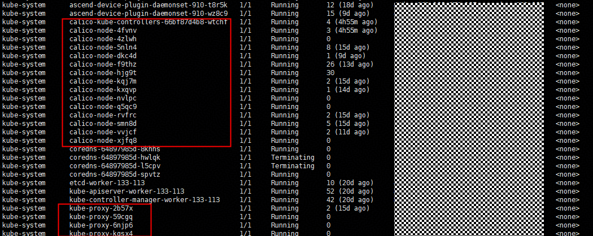
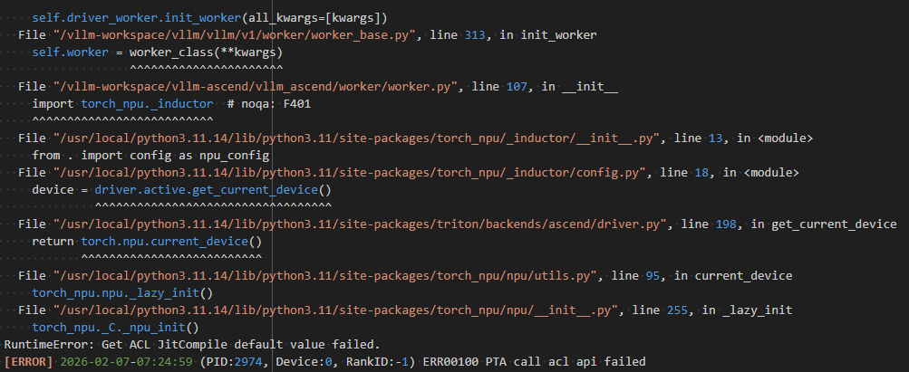
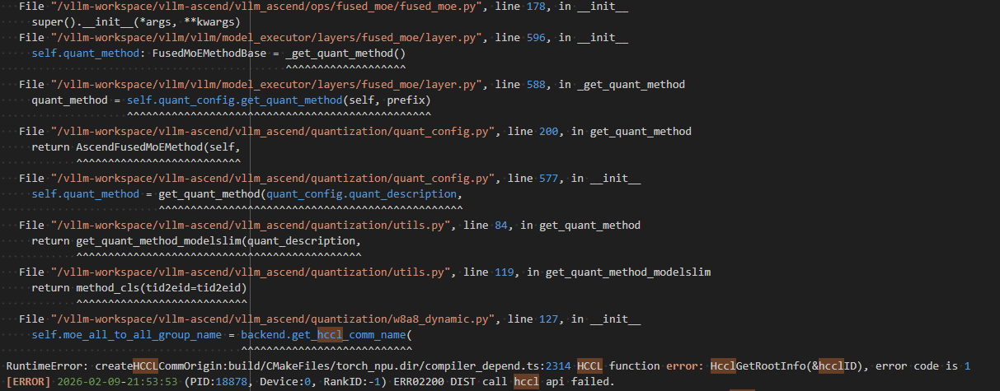

# MindIE PyMotor部署推理服务常见问题

## Kubernetes节点间pod网络不通

**问题描述**

部署服务失败，PyMotor日志中显示Controller和PD实例之间的网络通信异常。

<br>

**原因分析**

大规模专家并行方案中包括通算节点和智算节点，一般情况下集群master节点和集群服务节点采用通算节点，可能会出现由于通算节点和智算节点网卡名不同，导致calico配置文件中的网卡名不适用于所有节点，因此当现场Kubernetes集群不同节点的pod出现网络不通问题时，可以参考以下思路排查处理。

  <br>

**解决方案**

在master节点执行kubectl get pod -A -owide命令，查看calico和kube-proxy的pod状态是否出现异常。


- 网络相关pod无异常（READY：1/1 + STATUS：Running，如上图所示）：
  如果calico和kube-proxy的pod状态无任何异常，可以尝试重启pod（直接在master节点执行以下命令，删除网络相关pod，几秒钟后对应pod会重新启动）。

  ```bash
  kubectl get pods -n kube-system | grep calico | awk '{print $1}' | xargs kubectl delete pod -n kube-system
  kubectl get pods -n kube-system | grep kube-proxy | awk '{print $1}' | xargs kubectl delete pod -n kube-system
  ```

- 网络相关pod出现异常（READY：0/1）：
  如果pod状态出现异常，例如：某个calico的pod持续显示为ready 0/1。可以查看集群中所有节点（包括master和worker节点）的网卡名称。如果所有节点具有相同名称的网卡，如enp189s0f0，则在master节点执行kubectl edit ds -n kube-system calico-node命令，修改如下的网卡名（如果现场网卡做了bond，则填写bond名，如bond4）：

  ```yaml
  - name: IP_AUTODETECTION_METHOD
    value: interface=enp189s0f0
  ```

  如集群中所有节点的带内管理平面网卡名不全相同，例如一部分节点为enp189s0f0，另一部分节点为enp125s0f0，则修改如下网卡名：

  ```yaml
  - name: IP_AUTODETECTION_METHOD
    value: interface=enp189s0f0,enp125s0f0
  ```

如果上述方法均无法解决问题，可在master节点执行kubectl describe pod -n [pod命名空间] [pod名称]以及kubectl logs -n [pod命名空间] [pod名称]查看对应pod的信息和日志，分析具体原因并解决。

## 部署服务时，发现日志报错 Get ACL JitCompile default value failed

**问题描述**
服务调用torch_npu失败，查看P或者D节点的日志，出现如下报错：



<br>

**原因分析**
pod内无法使用NPU，可能CANN组件无法调用，进入pod内尝试set_device操作，通常会出现同样报错。


在pod内查看plog，进入路径~/ascend/log/debug/plog。在该目录下执行ll -rt命令筛查出最新的plog，并执行`cat [最新plog文件名]`命令查看最新的plog，发现运行权限不足。


**解决方案**

可参考昇腾社区[故障案例](https://www.hiascend.com/developer/blog/details/0297201752127535078)。

## HCCL链接异常

**问题描述**

HCCL链接失败，查看P或者D节点的日志，出现如下报错：



**原因分析**

硬件故障和相关环境变量设置出错均有可能导致该问题。

**解决方案**

- 确保启动脚本文件夹下的`examples/infer_engines/vllm/env.json` 等（以实际使用的配置为准，如 `examples/infer_engines/vllm/models/deepseek/v3_1/env_v3_1_A2_EP32.json`）文件中HCCL_CONNECT_TIMEOUT环境变量取值在[120,7200]的范围内，随后登录到报错服务器上执行`npu-smi set -t reset -i id -c chip_id [-m 1]`对npu执行复位操作。

  - id：通过`npu-smi info -l`命令查出的NPU ID即为设备ID。
  - chip_id：芯片id。通过npu-smi info -m命令查出的Chip ID即为芯片id。

- 如上述操作无法解决问题，可参考昇腾社区相关[故障诊断](https://www.hiascend.com/document/detail/zh/canncommercial/850/commlib/hcclug/hcclug_000048.html)文档定位问题。

## docker中存在对应镜像，但是在pod创建阶段显示拉取镜像失败

**问题描述**
    <br>执行kubectl get pod -A -owide命令，看到mindie-motor命名空间下的pod处于ErrImagePull状态


**原因分析**

- Kubernetes版本低于1.23：Kubernetes 通过 Docker 的 API 操作，镜像存储在 Docker 的存储中。
- Kubernetes版本高于1.23：Kubernetes 通过 CRI 与容器运行时通信，默认使用 containerd，不经过 Docker。

**解决方案**
    <br>k8s的版本较高，需要使用`ctr -n k8s.io image import [imageName]`命令加载镜像。

## 容器启动后报错 RuntimeError: can't start new thread

**问题描述**
某些节点上，Pod 启动后 Python 侧抛出 `RuntimeError: can't start new thread`；将容器的 `seccompProfile` 改为 `Unconfined` 后恢复正常。

**原因分析**
Linux seccomp 在拦截创建线程/进程相关的 syscall（如 `clone3`）。当使用 `seccompProfile.type: RuntimeDefault` 时，部分容器运行时的默认策略未放行 `clone3`，导致 glibc/pthread 创建线程失败。

**解决方案**
本仓库部署模板默认使用 `seccompProfile.type: Unconfined`，可避免该问题。若需更高安全等级或使用 RuntimeDefault，请参考 [Pod 权限说明](https://gitcode.com/Ascend/MindIE-PyMotor/blob/master/examples/features/pod_permission_guide/README.md)。

## 执行 `show_log.sh` 后无日志或在终端立即报错退出

**问题描述**
在 `examples/deployer` 下执行 `bash show_log.sh` 时，终端（stderr）立即打印英文错误并退出；或脚本已启动但长期看不到预期 Pod 日志落盘。

**原因分析**
`show_log.sh` 在启动 `log_monitor.py` **之前**会读取 `log_collect/log_config.ini` 的 `[LogSetting]`，校验 **`name_space` 非空**。**若未配置或留空**（仓库默认模板中 `name_space` 为空，须自行填写），脚本**不会**后台拉起 Python，而是在**当前终端**输出英文说明（例如提示设置 `name_space`）并以非零状态退出。**若已填写但与真实命名空间不一致**，`show_log.sh` 仍会启动采集进程，但 `kubectl get pods` / `kubectl logs` 会针对错误命名空间执行，可能出现无 Pod、拉不到目标组件日志、或 `output.log` / 落盘日志内容不符合预期等问题。

**解决方案**
若启动阶段即失败：根据终端上的英文提示，编辑 `examples/deployer/log_collect/log_config.ini`，在 `[LogSetting]` 下将 `name_space` 设置为与 `kubectl get pods -n <命名空间>` 中一致的值（与 PD 分离部署文档中的 `<job_id>` / 实际 workload 命名空间相同），保存后重新执行 `bash show_log.sh`。若进程已启动但行为异常，可查看 `log_collect/output.log` 与 `kubectl get pods -n <你的命名空间>` 核对命名空间与 Pod 名称。部署与日志采集的更多说明见 [PD 分离部署](../deployment/k8s/pd_disaggregation_deployment.md) 文档中「查看日志」小节。

## show_log.sh 日志中出现 failed to create fsnotify watcher: too many open files

**问题描述**
通过 `show_log.sh` 查看日志时，出现类似 `failed to create fsnotify watcher: too many open files` 的报错。

**原因分析**
该报错通常与 Linux **inotify** 资源上限有关（与进程 `ulimit -n` 的「打开文件数」不是同一项）。当需要监视的目录/文件数量较多时，若 `max_user_watches` 或 `max_user_instances` 过小，fsnotify 创建 watcher 会失败。可在问题节点上执行以下命令查看当前值，常见默认值约为 `8192` 与 `128`，偏小易触发本问题。

```bash
cat /proc/sys/fs/inotify/max_user_watches
cat /proc/sys/fs/inotify/max_user_instances
```

**解决方案**
在**宿主机或出现问题的运行环境**上提高 inotify 上限（需 root）。推荐编辑 `sysctl` 持久化配置后执行 `sysctl -p` 生效，例如将监视数与实例数调整为更大值：

```bash
# 编辑 sysctl 配置文件
sudo vim /etc/sysctl.conf
```

在文件中添加或修改为（数值可按现场规模调整）：

```text
fs.inotify.max_user_watches=1048576
fs.inotify.max_user_instances=512
```

保存后应用配置：

```bash
sudo sysctl -p
```
